`Siento la mala calidad de las imágenes, las capturas de pantalla de las grabaciones son horrorosas!`
`Ánimo con los estudios!!`

# Azure 204 - Developing Solutions for Microsoft Azure

>[Enlace al examen y las rutas de aprendizaje](https://docs.microsoft.com/en-us/learn/certifications/exams/az-204)

>[Enlace a los laboratorios de GitHub](https://github.com/MicrosoftLearning/AZ-204-DevelopingSolutionsforMicrosoftAzure)

>[Comandos de Azure CLI](https://github.com/CristinaSilvan/Microsoft-Azure/blob/main/AZ-204%20(Asscciate)/Comandos%20CLI.md)

**Conceptos importantes**:
- *Software escalable*: applicación utilizada por infinidad de usuarios (lo opuesto a un software usado por uno o pocos miembros dentro de una misma organización)

- *SDLA o software development life cycle*: El ciclo de desarrollo, compilación, testeo, despliegue, versionamiento y demás que se lleva a cabo en la producción del software y que continua con la actualización del mismo

- *SLA (Service Level Agreement)*: Acuerdo de alta disponibilidad mínima de recursos medido en porcentaje

- *Planes SKU*: planes de tarifa para los diferentes servicios que se ajusta a las necesidades y difieren en los precios

- *Instancias en Azure Functions*: llamadas o solicitudes mediante protocolo hacia un servicio

> NOTA: Es necesario conocer los distintos planes según lo que ofrecen

---
---
---

# Índice

## [Intro](#introducción)
## [Ruta certificación](#ruta-completa-certificación)
## [Esquema módulos](#esquema-de-módulos)

---
---
---

`<Arreglar, no funcionan estos enlaces>`
## [Creación de aplicaciones web](#creación-de-aplicaciones-web)
## [Implementación de Azure Functions](#implementación-de-azure-functions)

---
---
---

# Introducción
`<Clase del 29/06/2022>`

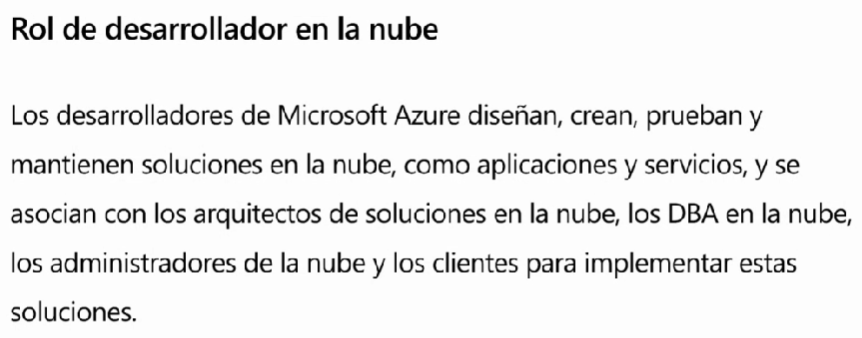

# Ruta completa certificación

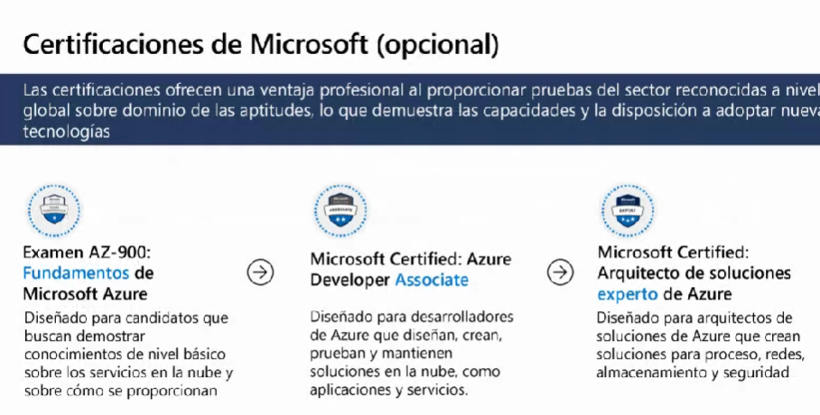

[AZ-900 Fundamentals](https://docs.microsoft.com/en-us/certifications/exams/az-900)

[AZ-204 Associate](https://docs.microsoft.com/en-us/certifications/exams/az-204)

[AZ-400 Expert](https://docs.microsoft.com/es-es/certifications/exams/az-400)

# Esquema de módulos

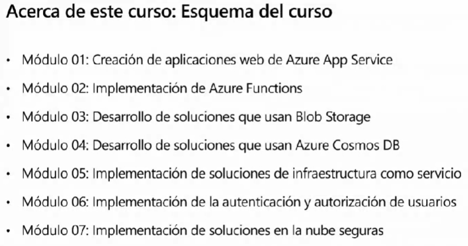
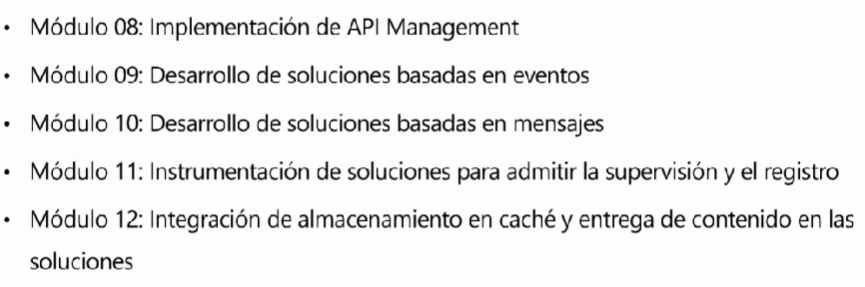

# Creación de aplicaciones web

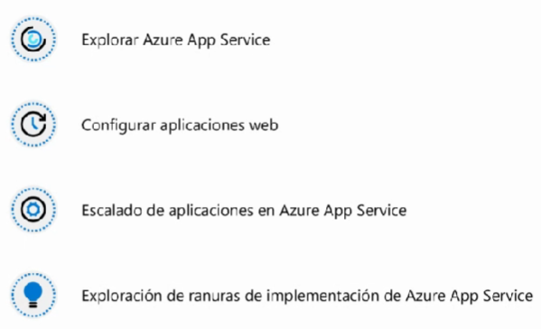

- Es un servicio **PAAS (Platform as a Service)**

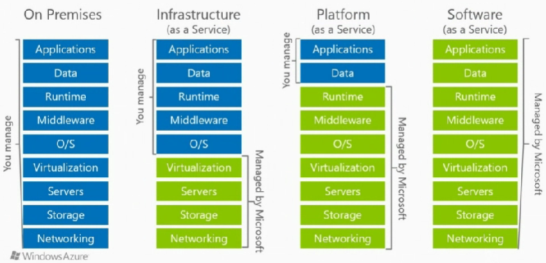

- Servicio **basado HTTP** (Protocolo de transferencia de datos a través de internet, *Hypertext Transfer Protocol*); define la sintáxis y semántica de la **comunicación entre aplicaciones web**

- Permite **hospedar aplicaciones web, API de Rest y back-ends para dispositivos móviles**

- Alojar mi solución en una **Azure App Web** permite el **escalado de recursos** de forma manual o automática

- El **back-end** de la solución normalmente se encuentra alojado en un repositorio de código (**Azure App Service me permite hacerlo de forma nativa ya que se encuentra vínculado a Azure DevOps y aparte es compatible con GitHub y BitBucked**)

- En el repositorio es donde se lleva a cabo el **ciclo de vida** (SDLC, *software development life cycle*)

- Las **Ranuras de implementación** permiten gestionar de una forma más efectiva las subidas de versiones al entorno de producción. Cada vez que actualizamos la web, hacen falta una serie de procesos que pueden hacer que nuestro servicio dejen de funcionar durante dicha actualización. Debido al **SLA de Windows (Service Level Agreement)**, es necesario asegurar la alta disponibilidad del servicio

- Para poder tener un **App Service** es indispensable tener un **App Service Plan** del que colgará mi App; Al igual que los recursos deben estar vinculados a un **resource group**

- Un **Azure App Service Plan** es un conjunto de recursos necesarios para tener una aplicación web (es como una máquina de la que tira mi app web pero más complejo)

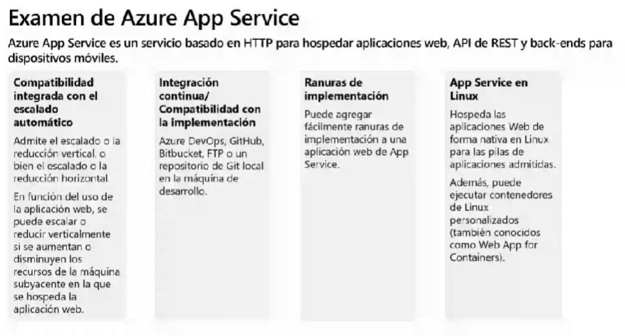

- Los **App Service Plan** deben tener una tarifa en función de la cual se desplegará la **Web App** y que especifica la cantidad de tiempo/peticiones que puede alcanzar. Los distintos planes se serparan según la utilidad que tenga la aplicación web:
    - Proceso compartido
    - Proceso dedicado
    - Aislado
    - Consumo

(Los planes pueden ser modificados en cualquier momento según los requerimientos, ya que una vez consumido su límite, la aplicación deja de funcionar)

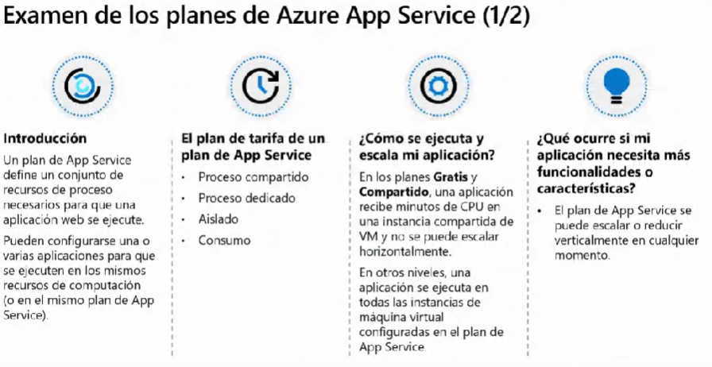

- Muchos **Web Apps** pueden estar contenidos dentro de un mismo **App Service Plan**, aunque puede haber problemas si abusamos

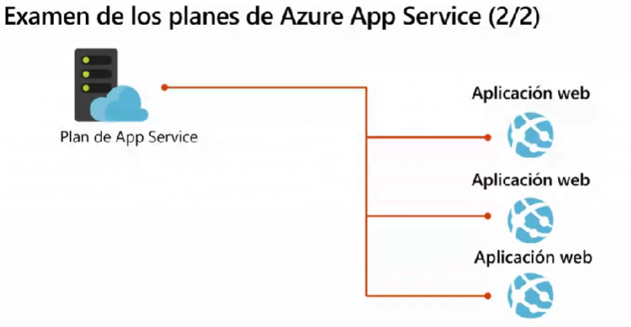

- Hay varios "caminos" para compilar el código del repositorio y llevarlo a mi App Service, aunque lo lógico es **hacerlo de una forma automatizada**. Lo ideal es que sea compilado en la nube con herramientas como **Azure DevOps** y demás antes mencionados para verificar que puede ser compilado en cualquier ordenador al margen del equipo o máquina que use el desarrollador (**que pueda tener instalados paquetes que el resto de usuarios finales no**)

- También llamado **CI CD (Contincontinuous integration and continuous delivery)** ya que todo el **SDLA** se produce en la nube

- El uso de **ranuras de implementación** permite que los usuarios sigan utilizando la solución sin interrupciones de actualización exponiendo un **duplicado temporal de la solución** durante el transcurso de la actualización para que sea consumida en su lugar

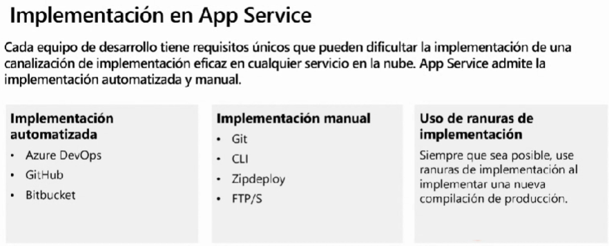

- Es posible añadir un **factor de autenticación** a nuestra App Service para la que el **usuario o programa** que quiera usar mi aplicación tenga que pasar por un **proveedor de autenticación** (ya que se hace de forma externa y este retorna la información a mi app)

- También se puede especificar un comportamiento de **autorización** para otorgar permisos y que dependiendo de este, mi solución se muestre de una forma u otra, o que permita o no ciertos comportamientos

- **Azure tiene autenticaciones integradas** que sin necesidad de que nosotros administremos, se comunican con los **proveedores**

- Proveedores que se encuentran de **forma predeterminada** en la plataforma:
    - Microsoft
    - Facebook
    - Google
    - Twitter

(Existen otros con los que podemos autenticar y que también se basan en **OAuth o Open Authoritation**, que es un **estándar abierto** que define cómo, de forma segura, se debe realizarse la autorización de una API para aplicaciones web, móviles o de escritorio)

- Es posible **configurar el App Service para que pueda utilizar otros proveedores** que cumplan con el **OAuth**, dando la opción a los usuarios de que se idenfiquen mediantes otras plataformas

- Azure App Service permite esta configuración de forma **automática y más rápida que de la manera convencional**

- La autenticación se lleva a cabo **mediante cookies** que transmiten la información de forma **Segura** mediante el proveedor y nuestra Web App

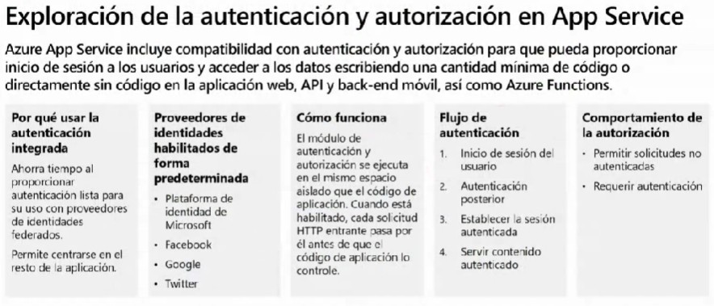

- Las **conexiones híbridas** permiten a nuestra aplicación web trabajar con **bases de datos que por motivos de seguridad, políticas u otros se encuentren On-premise** (No está disponible en todos los **planes de SKU**)

- En la App Service se puede controlar el acceso **mediante determinadas APIs o VPNs (filtrándo cuáles pueden acceder)** e incluso controlar las
**salidas de datos** de mi aplicación

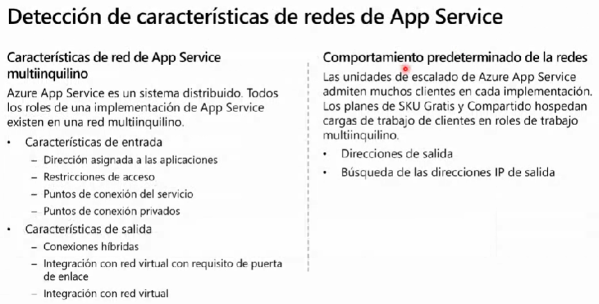

> [Volver al Índice](#índice)

---
---
---

# Implementación de Azure Functions
`<Clase del 01/07/2022>`

## Qué es un Azure Function

[Enlace a documentación Microsoft](https://docs.microsoft.com/es-es/azure/azure-functions/functions-overview)

Es una solución que permite escribir menos código, mantener menos infraestructura para ahorrar costos. En lugar de preocuparse por implementar y mantener servidores (**Serverless**), la infraestructura en la nube proporciona todos los recursos actualizados necesarios para mantener las aplicaciones en ejecución

Como desarrolladores, nos centramos en los fragmentos de código que importan y Azure Functions se ocupa del resto de forma secundaria

En definitiva, permiten que se ejecute **una determinada lógica ante una acción que ocurra**

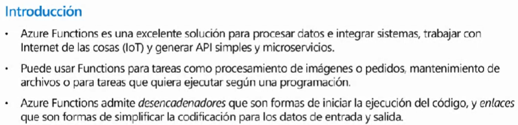

- Ejemplos de uso:

    - *Integrar sistemas*: es decir, **comunicación entre distintos sistemas** mediante pequeños trozos de código sin tener que levantar proyectos completos de desarrollo o máquinas virtuales (**una funcionalidad muy concreta**)
    
    - *IoT o Internet de las cosas*: para realizar la **comunicación vía internet con dispisitivos** o electrodomésticos por ejemplo, ya sea para supervisar u ordenar

    - *Implementación de microservicios*: en lugar de tener un proyecto gigantesco, **separo el código en pequeñas partes cada una con una funcionalidad** (estas últimas serían funcions) y permiten una actualización modular/alta tolerancia a fallos

    - *Procesamiento de imágenes o pedidos*: para **comprimir imágenes o lo que se considere** necesario según el caso

    - *Desencadenadores*: pueden ser utilizadas como **triggers** que desencadenen sucesos

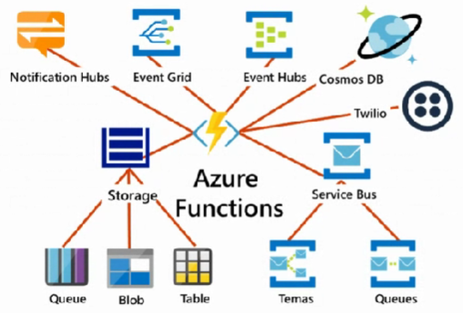

## Qué es Azure Logic App

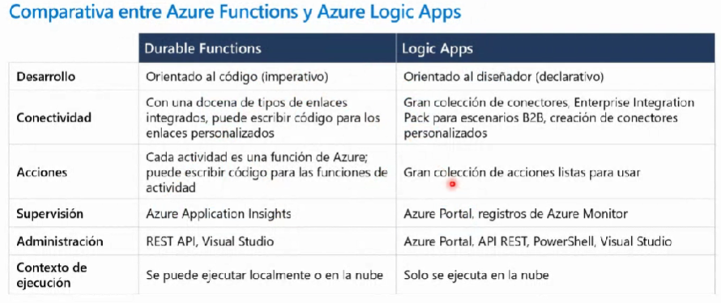

Utiliza conectores para llevar a cabo un flujo de trabajo que le especifiquemos

## Qué es WebJobs

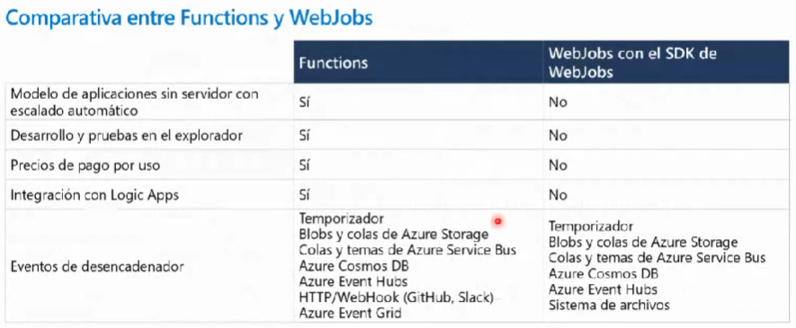

Permite meter una pequeña funcionalidad que se ejecute cada cierto tiempo o ante cualquier determinada situación **dentro de una aplicación web .NET**

## Hospedaje de Azure Functions

Tarifas de planes según la carga de trabajo que tenga que sorportar nuestra App Service:

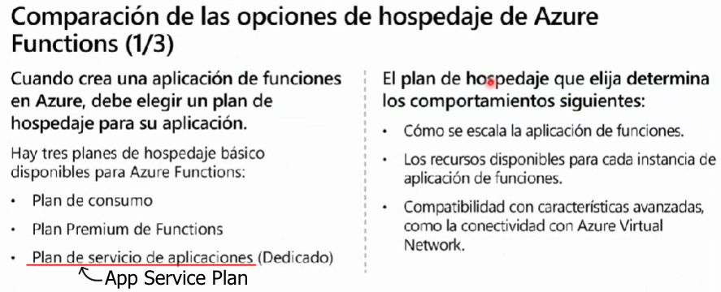

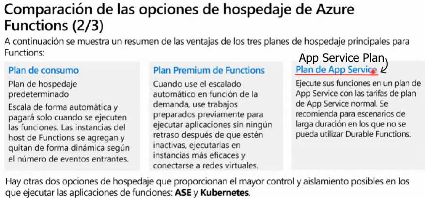

**Plan de Consumo**: tarifa predeterminada que se encarga de escalar los recursos (sin tener nosotros que definir el cómo se escala, ya que es el mismo Azure el que decide según la situación) en función de las llamadas que reciba por parte de los usuarios. Tomará más recursos cuando los necesita y los reducirá cuando no sean requeridos de forma dinámica

**Plan Premium**: también funciona bajo demanda pero tiene unas caracterísiticas más avanzadas que el plan de consumo. No tiene **retardo inicial** en responder a las llamadas ya que siempre está preparado para devolver la información necesaria

**Plan de App Service**: colgamos la Azure Function **como si fuera una App Service más**, y esta escalará o desescalará en función de la carga global que tenga el App Service

**RESUMEN**: En el plan de **consumo** y en el **premium**, es Azure quien decide el escalado según el consumo mediante un **controlador de escala** (en función del número de eventos, del consumo de recursos, el número de instancias, etc)

- Si elegimos la tercera tarifa, el Plan App Service:

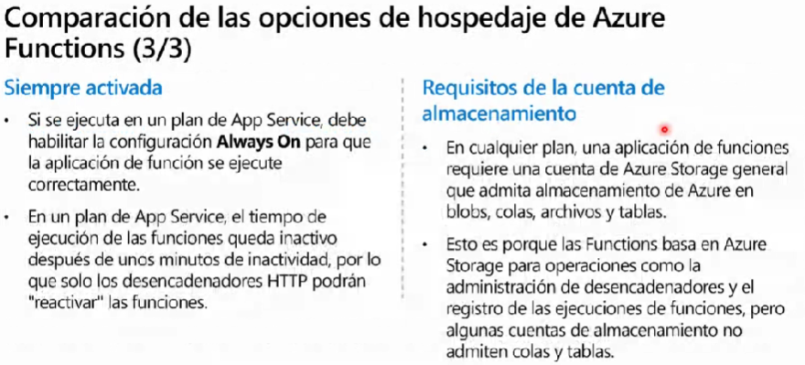

Si no configuramos el **Always On**, la App Service solo empezará una función tras un desencadenante (en algunos casos, puede no ser necesario; dependiendo de los requisitos)

Las Azure Functions pueden **necesitar cuentas de almacenamiento** para guardar información de seguimiento, de seguridad o de determinadas cosas que se requieran

## Escalado de Azure Functions

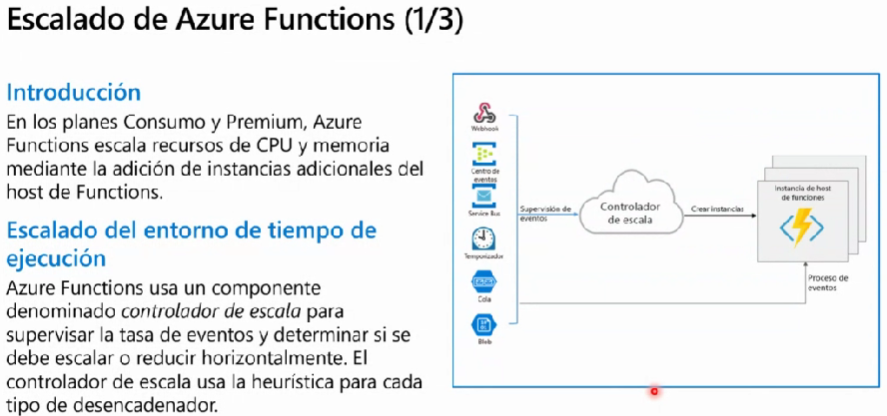
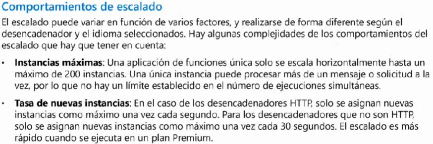

Evidentemente, podemos configurar el **número de instancias máxima** (llamadas o solicitudes) por segundo para que el servicio no colapse o se dispare el costo

El escalado se mide mediante el **número de instancias**, no de la **potencia**

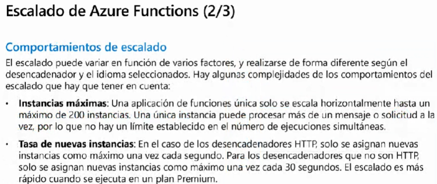

<Continuación en minuto 31:00>

> [Volver al Índice](#índice)

---
---
---
