`Siento la mala calidad de las im谩genes, las capturas de pantalla de las grabaciones son horrorosas!`
`nimo con los estudios!!`

# Azure 204 - Developing Solutions for Microsoft Azure

>[Enlace al examen y las rutas de aprendizaje](https://docs.microsoft.com/en-us/learn/certifications/exams/az-204)

>[Enlace a los laboratorios de GitHub](https://github.com/MicrosoftLearning/AZ-204-DevelopingSolutionsforMicrosoftAzure)

>[Comandos de Azure CLI](https://github.com/CristinaSilvan/Microsoft-Azure/blob/main/AZ-204%20(Asscciate)/Otros%20apuntes/Comandos%20CLI.md)

>[Respuestas de los QUIZ de clase](https://github.com/CristinaSilvan/Microsoft-Azure/blob/main/AZ-204%20(Asscciate)/Otros%20apuntes/Respuestas%20de%20los%20QUIZ.md)

>[Respuestas Ex谩menes](https://github.com/CristinaSilvan/Microsoft-Azure/blob/main/AZ-204%20(Asscciate)/Otros%20apuntes/Respuestas%20Ex%C3%A1menes.md)

**Conceptos importantes**:
- *Software escalable*: applicaci贸n utilizada por infinidad de usuarios (lo opuesto a un software usado por uno o pocos miembros dentro de una misma organizaci贸n)

- *SDLA o software development life cycle*: El ciclo de desarrollo, compilaci贸n, testeo, despliegue, versionamiento y dem谩s que se lleva a cabo en la producci贸n del software y que continua con la actualizaci贸n del mismo

- *SLA (Service Level Agreement)*: Acuerdo de alta disponibilidad m铆nima de recursos medido en porcentaje

- *Planes SKU*: planes de tarifa para los diferentes servicios que se ajusta a las necesidades y difieren en los precios

- *Instancias en Azure Functions*: llamadas o solicitudes mediante protocolo hacia un servicio

>> NOTA: Es necesario conocer los distintos planes seg煤n lo que ofrecen **(Free (F), Basic (B), Standar (S))**

>> (El plan **Free** no contiene escalado autom谩tico)

---
---
---

# ndice

## [Intro](#introducci贸n)
## [Ruta certificaci贸n](#ruta-completa-certificaci贸n)
## [Esquema m贸dulos](#esquema-de-m贸dulos)

---
---
---

## [M贸dulo 1: Creaci贸n de aplicaciones web](#m贸dulo-1)

## [M贸dulo 2: Implementaci贸n de Azure Functions](#m贸dulo-2)

## [M贸dulo 3: Desarrollo de soluciones que usan Blob Storage](#m贸dulo-3)

## [M贸dulo 4: Desarrollo de soluciones que usan Azure Cosmos DB](#m贸dulo-4)

## [M贸dulo 5: Implementaci贸n de soluciones de infraestructura como servicio](#m贸dulo-5)

## [M贸dulo 6: Implementaci贸n de la autenticaci贸n y autorizaci贸n de usuarios](#m贸dulo-6)

## [M贸dulo 7: Implementaci贸n de soluciones en la nube seguras](#m贸dulo-7)

## [M贸dulo 8: Implementaci贸n de API Management](#m贸dulo-8)

## [M贸dulo 9: Desarrollo de soluciones basadas en eventos](#m贸dulo-9)

## [M贸dulo 10: Desarrollo de soluciones basadas en mensajes](#m贸dulo-10)

## [M贸dulo 11: Instrumentaci贸n de soluciones para admitir la supervisi贸n y el registro](#m贸dulo-11)

## [M贸dulo 12: Integraci贸n de almacenamiento en cach茅 y entrega de contenido en las soluciones](#m贸dulo-12)

---
---
---

# Introducci贸n

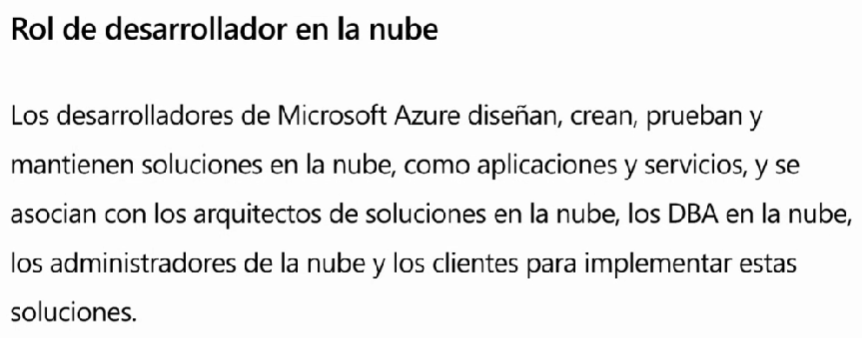

# Ruta completa certificaci贸n


[AZ-900 Fundamentals](https://docs.microsoft.com/en-us/certifications/exams/az-900)

[AZ-204 Associate](https://docs.microsoft.com/en-us/certifications/exams/az-204)

[AZ-400 Expert](https://docs.microsoft.com/es-es/certifications/exams/az-400)

# Esquema de m贸dulos


---
---
---

# M贸dulo 1
# (Creaci贸n de aplicaciones web)
>>`<Clase del 01/07/2022>`

[Enlace a documentaci贸n Microsoft](https://docs.microsoft.com/es-es/azure/app-service/)

[Enlace a documentaci贸n Microsoft](https://azure.conosur.tech/azurefundamentals-que-es-un-azure-app-service-plan-y-para-que-sirve/)

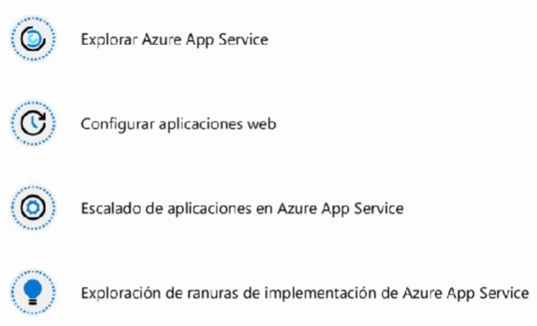

## Es un servicio **PAAS (Platform as a Service)**


Servicio **basado HTTP** (Protocolo de transferencia de datos a trav茅s de internet, *Hypertext Transfer Protocol*); define la sint谩xis y sem谩ntica de la **comunicaci贸n entre aplicaciones web**

Permite **hospedar aplicaciones web, API de Rest y back-ends para dispositivos m贸viles**

Alojar mi soluci贸n en una **Azure App Web** permite el **escalado de recursos** de forma manual o autom谩tica

El **back-end** de la soluci贸n normalmente se encuentra alojado en un repositorio de c贸digo (**Azure App Service me permite hacerlo de forma nativa ya que se encuentra v铆nculado a Azure DevOps y aparte es compatible con GitHub y BitBucked**)

En el repositorio es donde se lleva a cabo el **ciclo de vida** (SDLC, *software development life cycle*)

Las **Ranuras de implementaci贸n** permiten gestionar de una forma m谩s efectiva las subidas de versiones al entorno de producci贸n. Cada vez que actualizamos la web, hacen falta una serie de procesos que pueden hacer que nuestro servicio dejen de funcionar durante dicha actualizaci贸n. Debido al **SLA de Windows (Service Level Agreement)**, es necesario asegurar la alta disponibilidad del servicio

Para poder tener un **App Service** es indispensable tener un **App Service Plan** del que colgar谩 mi App; Al igual que los recursos deben estar vinculados a un **resource group**

Un **Azure App Service Plan** es un conjunto de recursos necesarios para tener una aplicaci贸n web (es como una m谩quina de la que tira mi app web pero m谩s complejo)


[Enlace a documentaci贸n Microsoft](https://docs.microsoft.com/es-es/azure/app-service/overview-hosting-plans)

## Tarifas o planes

- Los **App Service Plan** deben tener una tarifa en funci贸n de la cual se desplegar谩 la **Web App** y que especifica la cantidad de tiempo/peticiones que puede alcanzar. Los distintos planes se serparan seg煤n la utilidad que tenga la aplicaci贸n web:
    - Proceso compartido
    - Proceso dedicado
    - Aislado
    - Consumo

(Los planes pueden ser modificados en cualquier momento seg煤n los requerimientos, ya que una vez consumido su l铆mite, la aplicaci贸n deja de funcionar)

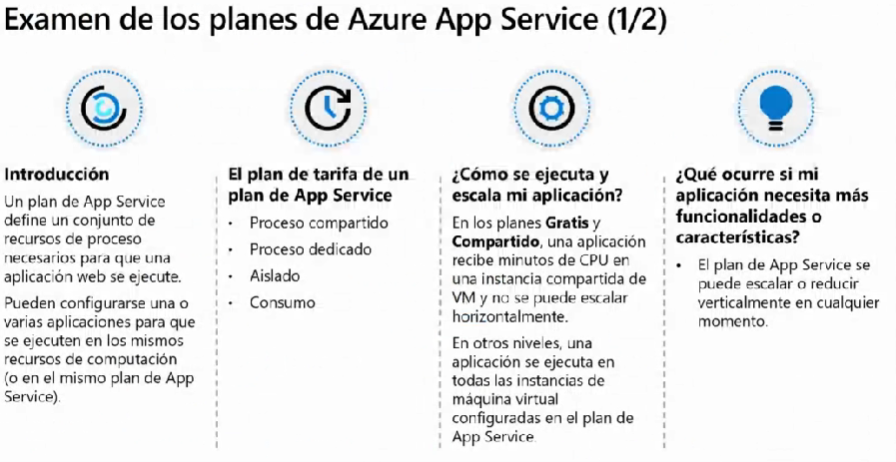

Muchos **Web Apps** pueden estar contenidos dentro de un mismo **App Service Plan**, aunque puede haber problemas si abusamos


## El SDLA de nuestra soluci贸n

Hay varios "caminos" para compilar el c贸digo del repositorio y llevarlo a mi App Service, aunque lo l贸gico es **hacerlo de una forma automatizada**. Lo ideal es que sea compilado en la nube con herramientas como **Azure DevOps** y dem谩s antes mencionados para verificar que puede ser compilado en cualquier ordenador al margen del equipo o m谩quina que use el desarrollador (**que pueda tener instalados paquetes que el resto de usuarios finales no**)

Tambi茅n llamado **CI CD (Contincontinuous integration and continuous delivery)** ya que todo el **SDLA** se produce en la nube

## Ranuras de implementaci贸n

El uso de **ranuras de implementaci贸n** permite que los usuarios sigan utilizando la soluci贸n sin interrupciones de actualizaci贸n exponiendo un **duplicado temporal de la soluci贸n** durante el transcurso de la actualizaci贸n para que sea consumida en su lugar


## Autenticaci贸n y proveedores 

Es posible a帽adir un **factor de autenticaci贸n** a nuestra App Service para la que el **usuario o programa** que quiera usar mi aplicaci贸n tenga que pasar por un **proveedor de autenticaci贸n** (ya que se hace de forma externa y este retorna la informaci贸n a mi app)

Tambi茅n se puede especificar un comportamiento de **autorizaci贸n** para otorgar permisos y que dependiendo de este, mi soluci贸n se muestre de una forma u otra, o que permita o no ciertos comportamientos

**Azure tiene autenticaciones integradas** que sin necesidad de que nosotros administremos, se comunican con los **proveedores**

- Proveedores que se encuentran de **forma predeterminada** en la plataforma:
    - Microsoft
    - Facebook
    - Google
    - Twitter

(Existen otros con los que podemos autenticar y que tambi茅n se basan en **OAuth o Open Authoritation**, que es un **est谩ndar abierto** que define c贸mo, de forma segura, se debe realizarse la autorizaci贸n de una API para aplicaciones web, m贸viles o de escritorio)

Es posible **configurar el App Service para que pueda utilizar otros proveedores** que cumplan con el **OAuth**, dando la opci贸n a los usuarios de que se idenfiquen mediantes otras plataformas

Azure App Service permite esta configuraci贸n de forma **autom谩tica y m谩s r谩pida que de la manera convencional**

La autenticaci贸n se lleva a cabo **mediante cookies** que transmiten la informaci贸n de forma **Segura** mediante el proveedor y nuestra Web App


Las **conexiones h铆bridas** permiten a nuestra aplicaci贸n web trabajar con **bases de datos que por motivos de seguridad, pol铆ticas u otros se encuentren On-premise** (No est谩 disponible en todos los **planes de SKU**)

En la App Service se puede controlar el acceso **mediante determinadas APIs o VPNs (filtr谩ndo cu谩les pueden acceder)** e incluso controlar las
**salidas de datos** de mi aplicaci贸n

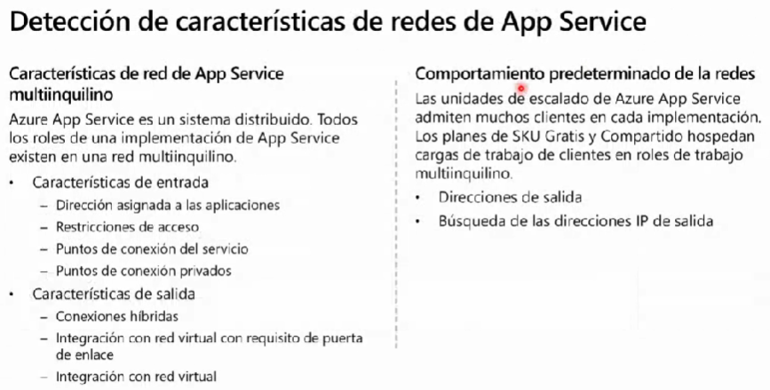

>> [Vuelve al ndice o descansa y t贸mate un algo](#铆ndice)

---
---
---

# M贸dulo 2
# (Implementaci贸n de Azure Functions)
>>`<Clase del 01/07/2022>`

## Qu茅 es un Azure Function

[Enlace a documentaci贸n Microsoft](https://docs.microsoft.com/es-es/azure/azure-functions/functions-overview)

Es una soluci贸n que permite escribir menos c贸digo, mantener menos infraestructura para ahorrar costos. En lugar de preocuparse por implementar y mantener servidores (**Serverless**), la infraestructura en la nube proporciona todos los recursos actualizados necesarios para mantener las aplicaciones en ejecuci贸n

Como desarrolladores, nos centramos en los fragmentos de c贸digo que importan y Azure Functions se ocupa del resto de forma secundaria

En definitiva, permiten que se ejecute **una determinada l贸gica ante una acci贸n que ocurra**

Cada Azure Function debe tener por fuerza **un desencadenador**

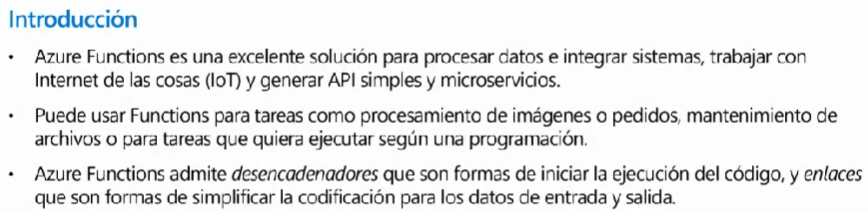

- Ejemplos de uso:

    - *Integrar sistemas*: es decir, **comunicaci贸n entre distintos sistemas** mediante peque帽os trozos de c贸digo sin tener que levantar proyectos completos de desarrollo o m谩quinas virtuales (**una funcionalidad muy concreta**)
    
    - *IoT o Internet de las cosas*: para realizar la **comunicaci贸n v铆a internet con dispisitivos** o electrodom茅sticos por ejemplo, ya sea para supervisar u ordenar

    - *Implementaci贸n de microservicios*: en lugar de tener un proyecto gigantesco, **separo el c贸digo en peque帽as partes cada una con una funcionalidad** (estas 煤ltimas ser铆an funcions) y permiten una actualizaci贸n modular/alta tolerancia a fallos

    - *Procesamiento de im谩genes o pedidos*: para **comprimir im谩genes o lo que se considere** necesario seg煤n el caso

    - *Desencadenadores*: pueden ser utilizadas como **triggers** que desencadenen sucesos

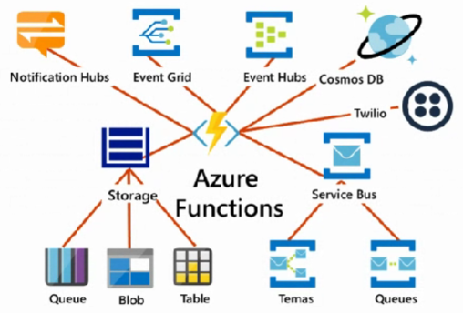

## Qu茅 es Azure Logic App

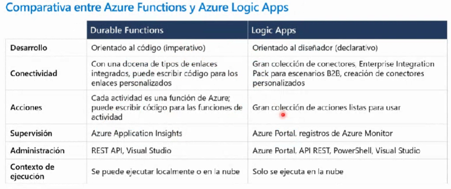

Utiliza conectores para llevar a cabo un flujo de trabajo que le especifiquemos

## Qu茅 es WebJobs


Permite meter una peque帽a funcionalidad que se ejecute cada cierto tiempo o ante cualquier determinada situaci贸n **dentro de una aplicaci贸n web .NET**

## Hospedaje de Azure Functions

Tarifas de planes seg煤n la carga de trabajo que tenga que sorportar nuestra App Service:

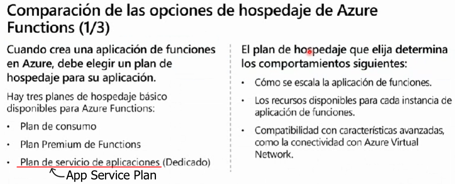

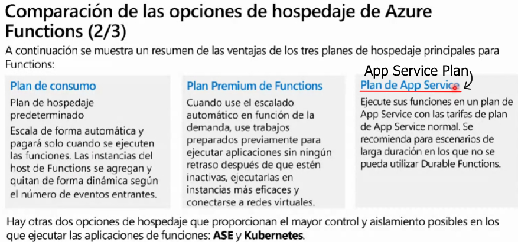

**Plan de Consumo**: tarifa predeterminada que se encarga de escalar los recursos (sin tener nosotros que definir el c贸mo se escala, ya que es el mismo Azure el que decide seg煤n la situaci贸n) en funci贸n de las llamadas que reciba por parte de los usuarios. Tomar谩 m谩s recursos cuando los necesita y los reducir谩 cuando no sean requeridos de forma din谩mica

**Plan Premium**: tambi茅n funciona bajo demanda pero tiene unas caracter铆siticas m谩s avanzadas que el plan de consumo. No tiene **retardo inicial** en responder a las llamadas ya que siempre est谩 preparado para devolver la informaci贸n necesaria

**Plan de App Service**: colgamos la Azure Function **como si fuera una App Service m谩s**, y esta escalar谩 o desescalar谩 en funci贸n de la carga global que tenga el App Service

**RESUMEN**: En el plan de **consumo** y en el **premium**, es Azure quien decide el escalado seg煤n el consumo mediante un **controlador de escala** (en funci贸n del n煤mero de eventos, del consumo de recursos, el n煤mero de instancias, etc)

---

Si elegimos la tercera tarifa, el Plan App Service:


Si no configuramos el **Always On**, la App Service solo empezar谩 una funci贸n tras un desencadenante (en algunos casos, puede no ser necesario; dependiendo de los requisitos)

Las Azure Functions pueden **necesitar cuentas de almacenamiento** para guardar informaci贸n de seguimiento, de sincronizaci贸n, de seguridad o de determinadas cosas que se requieran

## Escalado de Azure Functions

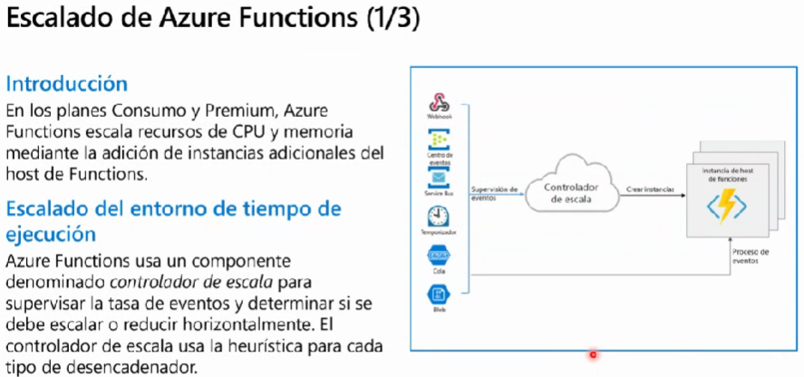

Evidentemente, podemos configurar el **n煤mero de instancias m谩xima** (llamadas o solicitudes) por segundo para que el servicio no colapse o se dispare el costo

El escalado se mide mediante el **n煤mero de instancias**, no de la **potencia**


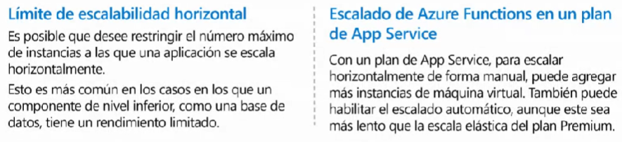

## Partes de un Azure Function

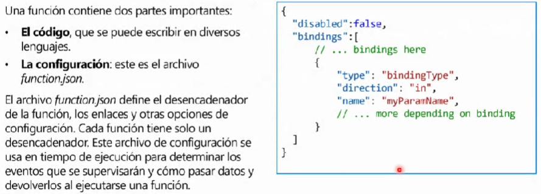

En nuestros proyectos **.NET**, adem谩s de un **.exe** o un **.dll**, debemos tener un fichero **json con la configuraci贸n** que defina la **Azure Function**

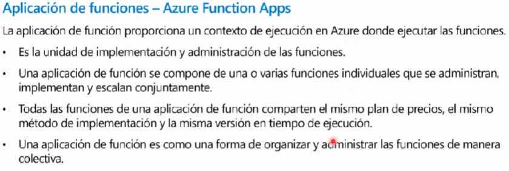

**Azure Function** ofrece un **contexto de ejecuci贸n**, al igual que cuando ejecutamos una aplicaci贸n de escritorio tenemos el contexto de un sistema operativo. Esto quiere decir que, entre nuestra Azure Function y nuestro sistema operativo, se generan una **serie de funcionalidades** cuando **levantamos** nuestra Azure Function relacionadas con su finalidad y que ayudan a que esta se lleve a cabo. La duraci贸n de estas funcionalidades termina con la finalizaci贸n del prop贸sito del Azure Funcion (componentes configurados para permitir el objetivo de la function que nacen y mueren junto con esta)

**Todas las funciones** que se encuentran dentro de **un mismo proyecto, comparten el mismo plan de precios** por fuerza. Tambi茅n comparten **m茅todos de implementaci贸n e incluso la misma versi贸n de tiempo de ejecuci贸n**

Esto sirve para **administrar las Azure Functions de forma conjunta**

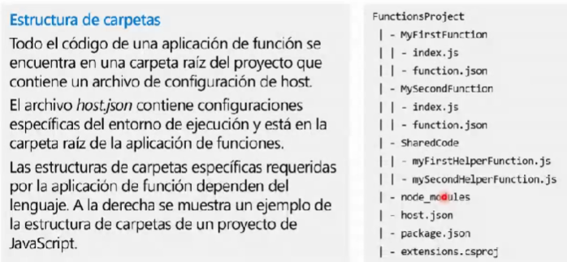

Azure Function no solo es compatible con **.NET**

Tambi茅n lo es con **Node.js o Python** por ejemplo; es un servicio abierto a todo tipo de lenguajes y frameworks

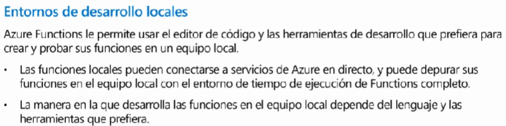

Las **Azure Functions** permiten a los desarrolladores trabajar en nuestro equipo con nuestras herramientas elegidas y luego conectarlas con **Azure cuando sea necesario**

Es decir, tenemos la opci贸n de **desarrollo local o en la nube** (es importante recordar que la compilaci贸n debe llevarse a cabo en la nube para evitar el problema antes mencionado sobre los paquetes del equipo local)

## Creaci贸n de desencadenadores y enlaces


El concepto es pr谩cticamente el mismo que con los **triggeres** (un conector configurado), excepto que en el caso de las **Azure Function** el desencadenador es a **nivel de c贸digo** 

En dicho c贸digo, se define **c贸mo se invoca ese desencadenador** y **cada funci贸n debe estar relacionada con un desencadenador** que la haga ejecutarse)

No se puede tener un **Azure Function** sin un desencadencadenador

---

Tambi茅n podemos tener **enlaces o bindings** que nos permite **vincular una funci贸n con un determinado recurso (cola de almaceamiento, tabla de storage, blob storage, base de datos,...)**

Estos **enlaces pueden ser de entrada, salida o ambos**

Los enlaces sirven para **simplificar el c贸digo para determinar qu茅 va a ocurrir** (si quiero tener una determinada funci贸n que se dispare cuando un usuario introduzca un fichero en un blob, necesito conectarme con ese blob para poder tener acceso a ese nuevo fichero; de la forma tradicional, ser铆a necesario un bloque de c贸digo para llevarlo a cabo; sin embargo, los **enlaces** simplifican el desarrollo ahorrando el c贸digo y sustituy茅ndolo con variables relacionadas que permiten el acceso de forma **simplificada**)

Yo puedo tener en una misma **Function** varios **enlaces**

## Definir desencadenadores y enlaces

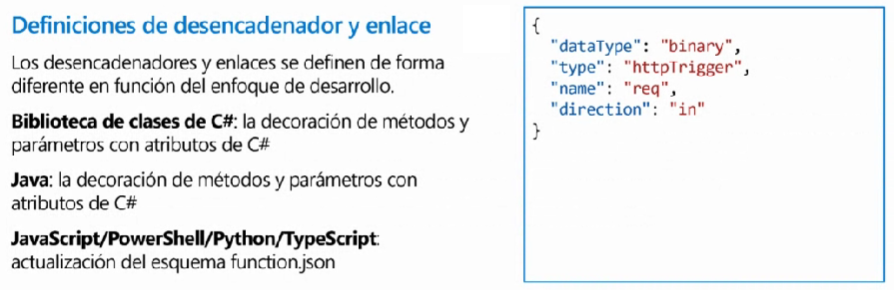

En el caso de **bibliotecas de C# y Java**, se definen mediante **atributos** (m茅todos y par谩metros)

En el caso de **JavaScript/PowerShell/Python/TypeScript**, se definen dentro del **fichero JSON** como en el ejemplo de la imagen 

Es decir, en el caso de **.NET y Java**, no va a ser necesario que toquemos ni redactemos el fichero **JSON** ya que van a ser las mismas herramientas del framework las que se encargaran de crearlo y configurarlo (aunque hay que tener en cuenta que el fichero existe dentro del proyecto y se define autom谩ticamente a ra铆z del c贸digo que dise帽emos)

(Si ser铆a necesario tocarlo en **los dem谩s frameworks** como se expecifica arriba)

## Direcci贸n de enlaces

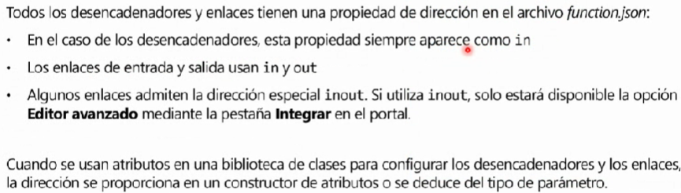

Los enlaces permiten **vincular** nuestras Azure Functions con algunos **servicios de Azure**

La vinculaci贸n puede ser de **entrada, salida o ambas** (in, out o inout)

**RESUMEN: desencadenador (desencadena la func贸n) y enlace (lo que necesita la funci贸n para llevar a cabo su objetivo)**

## Ejemplo 1
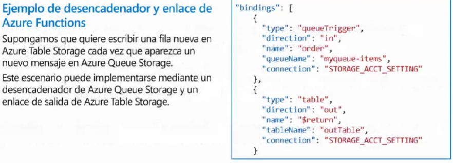

Este es un ejemplo de uso disparador/enlace (aqu铆 vemos un JSON)

En el caso de la imagen **Azure Queue Storage** es el desencadenador y **Azure Table Storage** el enlace o blinding, lo que significa que cada vez que alguien introduzca informaci贸n en la **Queu Storage**, va a a帽adirse una fila en la **Table Storage**

**Azure Table Storage** es un servicio que nos permite guardar informaci贸n de forma **tabular** (como una hoja de excel)

## Ejemplo 2
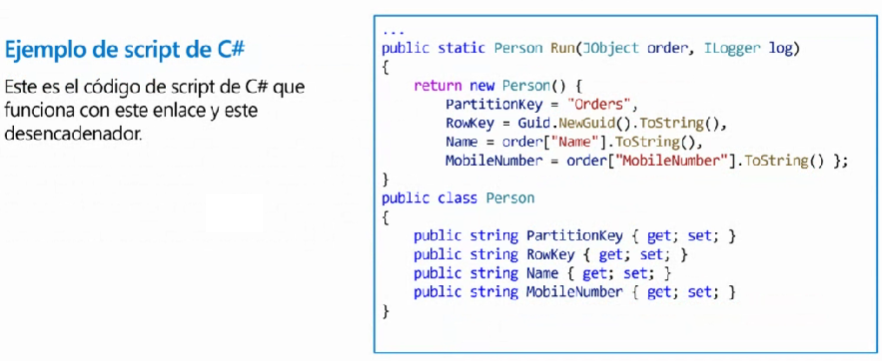

Otro ejemplo de uso disparador/enlace en C# (aqu铆 no es necesario configurar el JSON ya que este se crea autom谩ticamente seg煤n el c贸digo que especifiquemos, por lo que en el ejemplo analizamos el c贸digo C#)

## Otros Ejemplos

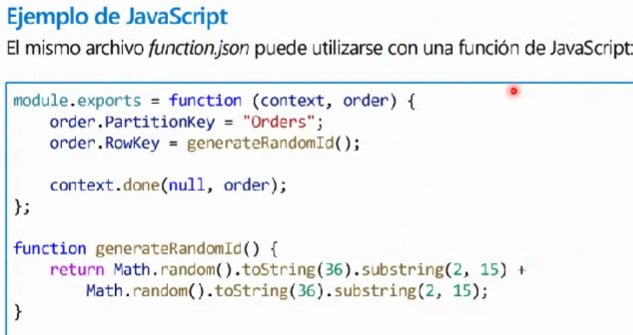
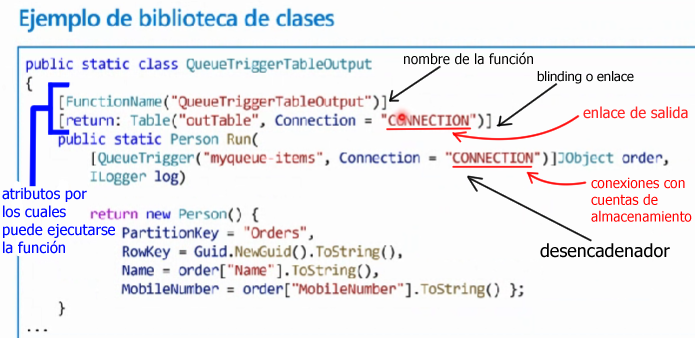

## Conexiones con cuentas de almacenamiento

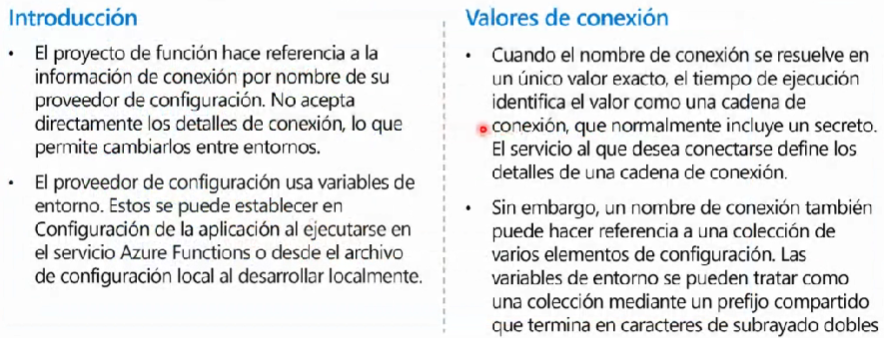
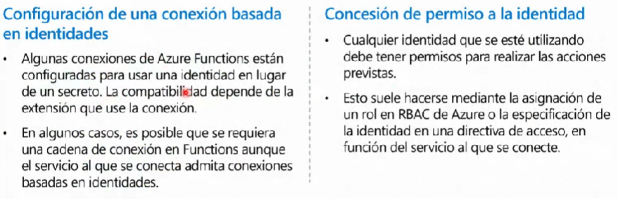

> **NOTA: el concepto de identidad se explica m谩s adelante junto al tema de seguridad**

## Examinando c贸digo


Una **Queue o cola** es una serie de mensajes apilados que al ser recibidos y cumplir con su funci贸n, desaparecen

Si el **mensaje de la cola** intenta su cometido tres veces sin conseguirlo, pasa a una **poison queue**

Cuando a帽adimos un mensaje a la **queue**, podemos indicarle el **tiempo de expiraci贸n**. Es decir, si despu茅s de dicho tiempo el mensaje no es le铆do, desaparecer谩 autom谩ticamente

## Implementaci贸n de Durable Functions o Funciones Durareras

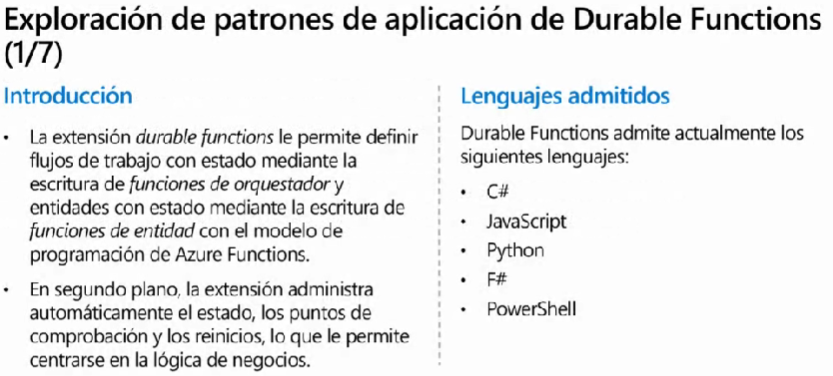

Un **patr贸n de dise帽o** es la definici贸n de c贸mo resolver un problema mediante un programa

Las **Durable Function** son b谩sicamente **Functions** cuyas ejecuciones son **durables en el tiempo** (es decir, que no se completen de forma instant谩nea, sino que necesita por ejemplo esperar respuestas o aprobaciones para finalizar)

Las **Durable Function**, para no ocupar recursos mientras sucede la espera, **se desactiva**

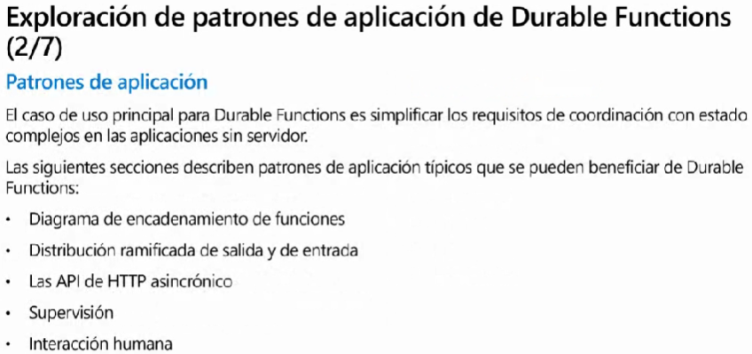


## Ejemplos de Patrones existentes:


Ejemplo de procesamiento del pedido (PATRN DE FUNCIONAMIENTO):

    F1: 驴El cliente est谩 al corriente de los pagos? S铆

    Almacenamiento: Guarda que est谩 al corriente de los pagos

    F2: 驴Hay suficiente mercanc铆a en el almac茅n? S铆

    Almacenamiento: Reserva la mercanc铆a

    F3: 驴Est谩 preparado el pedido?

    Almacenamiento: S铆, el pedido est谩 prepadado

    F4: Llama a la empresa de mensajer铆a para que venga a recogerlo

**Azure Durable Function** se encarga de que el ejemplo anterior funcione con coherencia

El **tiempo total** en este caso es la suma de los tiempos que tarda cada parte en acabar

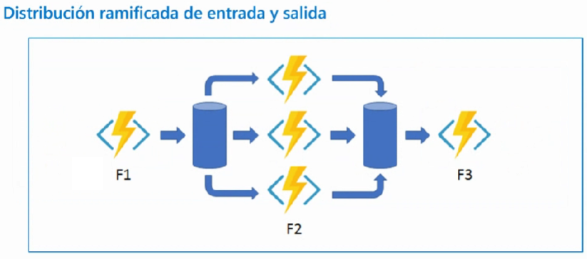

Ejemplo de procesamiento de pedido EN PARALELO (pedido con mercanc铆a de cada uno de los almacenes):
    
    La F1 consulta la existencia de la mercanc铆a necesaria para realizar el pedido completo

    La F2 lanza una tarea a cada uno de los almacenes para que preparen el producto del pedido que les corresponde

    La F3 llama al servicio de recogida

El **tiempo total** en este caso la suma de los componentes que m谩s tiempo tardan en cada fase, dado que el pedido no puede ser completado hasta que todas las partes han hecho su trabajo

>> [Vuelve al ndice o date una ducha fr铆a](#铆ndice)

---
---
---

# M贸dulo 3: 


>> [Vuelve al ndice o t贸mate un caf茅 por dios](#铆ndice)

---
---
---

# M贸dulo 4: 

>> [Vuelve al ndice o descansa un rato la vista](#铆ndice)

---
---
---

# M贸dulo 5: 

>> [Vuelve al ndice o sal con los amigos un rato](#铆ndice)

---
---
---

# M贸dulo 6: 

>> [Vuelve al ndice o haz una marat贸n de una serie](#铆ndice)


---
---
---

# M贸dulo 7: 

>> [Vuelve al ndice o date un chapuz贸n si tienes piscina](#铆ndice)

---
---
---

# M贸dulo 8: 

>> [Vuelve al ndice o 茅chate una siesta](#铆ndice)

---
---
---

# M贸dulo 9: 

>> [Vuelve al ndice o date una vuelta en moto](#铆ndice)

---
---
---

# M贸dulo 10: 

>> [Vuelve al ndice o dale ca帽a a la play](#铆ndice)


---
---
---

# M贸dulo 11: 

>> [Vuelve al ndice o vete a la playa a echar la tarde](#铆ndice)


---
---
---

# M贸dulo 12: 

>> [Vuelve al ndice o date un respiro por haber llegado al final](#铆ndice)

>> [ENHORABUENA](https://www.usameme.com/wp-content/uploads/2022/02/congratulations-meme-usameme.jpg)   


---
---
---
---
---
---


```

Notas personales:

M贸dulo2:
- A帽adir ejemplos de decoraci贸n de Azure Functions

- Es necesario una decoraci贸n para que sea una Azure Function

- A帽adir ?name=nombre a la url de la function, a帽ade el nombre a la queue

- Diferencia visual entre blinding y triggered en el c贸digo

```