`Siento la mala calidad de las imágenes, las capturas de pantalla de las grabaciones son horrorosas!`
`Ánimo con los estudios!!`😅

# Azure 204 - Developing Solutions for Microsoft Azure
[Notas personales](#notas-personales)

>[Enlace al examen y las rutas de aprendizaje](https://docs.microsoft.com/en-us/learn/certifications/exams/az-204)

>[Enlace a los laboratorios de GitHub](https://github.com/MicrosoftLearning/AZ-204-DevelopingSolutionsforMicrosoftAzure)

>[Comandos de Azure CLI](https://github.com/CristinaSilvan/Microsoft-Azure/blob/main/AZ-204%20(Asscciate)/Otros%20apuntes/Comandos%20CLI.md)

>[Respuestas de los QUIZ de clase](https://github.com/CristinaSilvan/Microsoft-Azure/blob/main/AZ-204%20(Asscciate)/Otros%20apuntes/Respuestas%20de%20los%20QUIZ.md)

>[Respuestas Exámenes](https://github.com/CristinaSilvan/Microsoft-Azure/blob/main/AZ-204%20(Asscciate)/Otros%20apuntes/Respuestas%20Ex%C3%A1menes.md)

>[Resumen de los Learning Paths de Microsoft](https://github.com/CristinaSilvan/Microsoft-Azure/blob/main/AZ-204%20(Assocciate)/Resumen%20de%20los%20Learning%20Paths.md)

**Conceptos importantes**:
- *Software escalable*: applicación utilizada por infinidad de usuarios (lo opuesto a un software usado por uno o pocos miembros dentro de una misma organización)

- *SDLA o software development life cycle*: El ciclo de desarrollo, compilación, testeo, despliegue, versionamiento y demás que se lleva a cabo en la producción del software y que continua con la actualización del mismo

- *SLA (Service Level Agreement)*: Acuerdo de alta disponibilidad mínima de recursos medido en porcentaje

- *Planes SKU*: planes de tarifa para los diferentes servicios que se ajusta a las necesidades y difieren en los precios

- *Instancias en Azure Functions*: llamadas o solicitudes mediante protocolo hacia un servicio

- *SDK o Software Development Kit*: es un grupo de herramientas que permiten a la programación de aplicaciones

>> NOTA: Es necesario conocer los distintos planes según lo que ofrecen **(Free (F), Shared (D), Basic (B), Standar (S),)**

>> (El plan **Free** no contiene escalado automático)

---
---
---

# Índice

## [Intro](#introducción)
## [Ruta certificación](#ruta-completa-certificación)
## [Esquema módulos](#esquema-de-módulos)

---
---
---

## [Módulo 1: Creación de aplicaciones web (parte I)](#creación-de-aplicaciones-web-parte-i)

## [Módulo 1: Creación de aplicaciones web (parte II)](#creación-de-aplicaciones-web-parte-ii)

## [Módulo 1: Creación de aplicaciones web (parte III)](#creación-de-aplicaciones-web-parte-iii)

## [Módulo 2: Implementación de Azure Functions](#módulo-2)

## [Módulo 3: Desarrollo de soluciones que usan Blob Storage](#módulo-3)

## [Módulo 4: Desarrollo de soluciones que usan Azure Cosmos DB](#módulo-4)

## [Módulo 5: Implementación de soluciones de infraestructura como servicio](#módulo-5)

## [Módulo 6: Implementación de la autenticación y autorización de usuarios](#módulo-6)

## [Módulo 7: Implementación de soluciones en la nube seguras](#módulo-7)

## [Módulo 8: Implementación de API Management](#módulo-8)

## [Módulo 9: Desarrollo de soluciones basadas en eventos](#módulo-9)

## [Módulo 10: Desarrollo de soluciones basadas en mensajes](#módulo-10)

## [Módulo 11: Instrumentación de soluciones para admitir la supervisión y el registro](#módulo-11)

## [Módulo 12: Integración de almacenamiento en caché y entrega de contenido en las soluciones](#módulo-12)

---
---
---

# Introducción

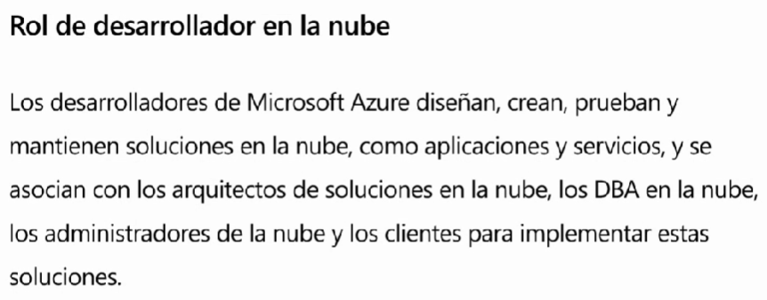

# Ruta completa certificación

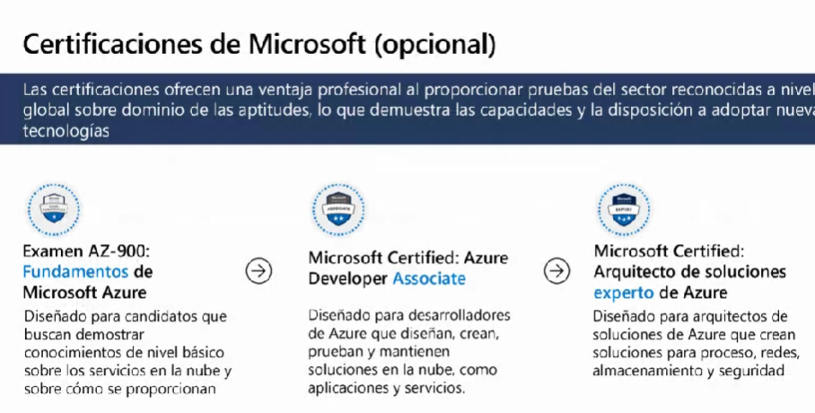

[AZ-900 Fundamentals](https://docs.microsoft.com/en-us/certifications/exams/az-900)

[AZ-204 Associate](https://docs.microsoft.com/en-us/certifications/exams/az-204)

[AZ-400 Expert](https://docs.microsoft.com/es-es/certifications/exams/az-400)

# Esquema de módulos

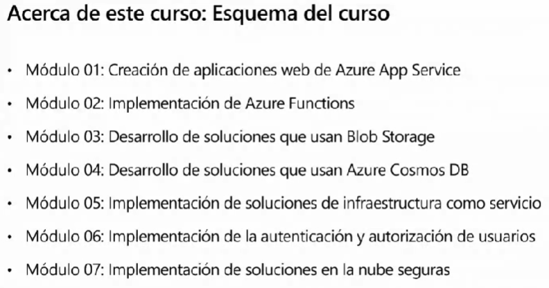
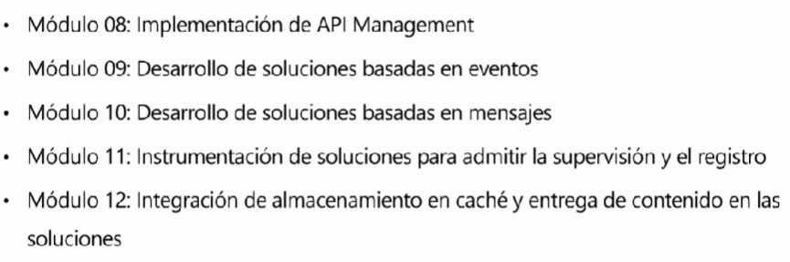

---
---
---

# Módulo 1
# (Creación de aplicaciones web (PARTE I))
>>`<Clase del 29/06/2022>`

[Enlace a documentación Microsoft](https://docs.microsoft.com/es-es/azure/app-service/)

[Enlace a documentación Microsoft](https://azure.conosur.tech/azurefundamentals-que-es-un-azure-app-service-plan-y-para-que-sirve/)

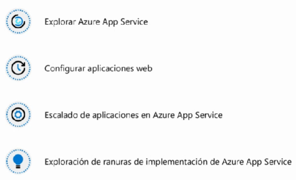

## Es un servicio **PAAS (Platform as a Service)**

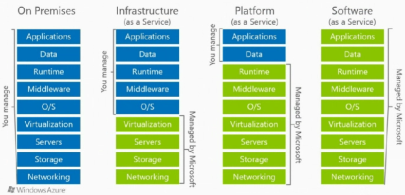

Servicio **basado HTTP** (Protocolo de transferencia de datos a través de internet, *Hypertext Transfer Protocol*); define la sintáxis y semántica de la **comunicación entre aplicaciones web** (Se basa en el protocolo TCP). Puede desarrollarlo en su lenguaje preferido, ya sea. NET, .NET Core, Java, Ruby, Node.js, PHP o Python. Las aplicaciones se ejecutan y escalan fácilmente en los entornos Windows y Linux.

## Compatibilidad integrada con el escalado automático

Permite **hospedar aplicaciones web, API de Rest y back-ends para dispositivos móviles** (es decir, la comunicación de un dispositivo móvil con un servicio web para completar el funcionamiento de una aplicación móvil)

Alojar mi solución en una **Azure App Web** permite el **escalado de recursos** de forma manual o automática

Este escalado puede ser **horizontal o vertical**, siendo el escalado automático solo horizontal

>NOTA: horizontal (aumentar el número de máquinas que ejecutan mi aplicación); vertical (aumentar la potencia de dichas máquinas)

Azure Portal proporciona **integración e implementación** continuas listas para usar con **Azure DevOps, GitHub, Bitbucket, FTP o un repositorio de GIT local** en el equipo de desarrollo

El **back-end** de la solución normalmente se encuentra alojado en un repositorio de código (**Azure App Service me permite hacerlo de forma nativa ya que se encuentra vínculado a Azure DevOps y aparte es compatible con GitHub y BitBucked**)

En el repositorio es donde se lleva a cabo el **ciclo de vida** (SDLC, *software development life cycle*)

## Ranuras de implementación 

Las ranuras de implementación son a**plicaciones activas con sus propios nombres de host**. Los elementos de contenido y configuraciones de aplicaciones se pueden intercambiar entre dos ranuras de implementación, incluida la ranura de producción.

Las **Ranuras de implementación** permiten gestionar de una forma más efectiva las subidas de versiones al entorno de producción. Cada vez que actualizamos la web, hacen falta una serie de procesos que pueden hacer que nuestro servicio dejen de funcionar durante dicha actualización. Debido al **SLA de Windows (Service Level Agreement)**, es necesario asegurar la alta disponibilidad del servicio

Para poder tener un **App Service** es indispensable tener un **App Service Plan** del que colgará mi App; Al igual que los recursos deben estar vinculados a un **resource group**

Un **Azure App Service Plan** es un conjunto de recursos necesarios para tener una aplicación web (es como una máquina de la que tira mi app web pero más complejo)

**No se pueden mezclar las aplicaciones Windows y Linux** en el mismo plan de App Service, sin embargo **sí en el mismo grupo de recursos**

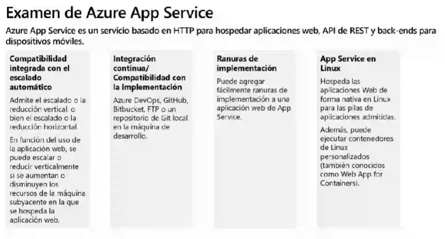

[Enlace a documentación Microsoft](https://docs.microsoft.com/es-es/azure/app-service/overview-hosting-plans)

## Tarifas o planes

- Los **App Service Plan** deben tener una tarifa en función de la cual se desplegará la **Web App** y que especifica la cantidad de tiempo/peticiones que puede alcanzar. Los distintos planes se serparan según la utilidad que tenga la aplicación web:
    - **Proceso compartido**: tanto **Gratis** como **Compartido** comparten grupos de recursos de sus aplicaciones con las aplicaciones de otros clientes. Estos planes asignan cuotas de CPU a cada aplicación que se ejecuta en los recursos compartidos, y los recursos **no se pueden escalar horizontalmente**

    - **Proceso dedicado (Dedicated compute)**: Los planes **Básico, Estándar, Premium, PremiumV2 y PremiumV3** ejecutan aplicaciones en VM de Azure dedicadas. Solo las aplicaciones del mismo plan de App Service comparten los mismos recursos de proceso. Cuanto mayor sea el plan, más instancias de VM estarán **disponibles para la escalabilidad horizontal**

    - **Aislado**: Este nivel ejecuta máquinas virtuales de Azure dedicadas en instancias de Microsoft Azure Virtual Network. **Proporciona aislamiento de red, además de aislamiento de proceso a sus aplicaciones**. Proporciona **las máximas posibilidades de escalabilidad horizontal**

    - **Consumo**: este plan solo está disponible para **Function Apps**. Escala las funciones de manera dinámica según la carga de trabajo

>NOTA: Los planes pueden ser modificados en cualquier momento según los requerimientos, ya que una vez consumido su límite, la aplicación deja de funcionar

>NOTA: el gratis es el único plan que no nos permite establecer un dominio propio (un link personalizado)

>NOTA: En el gratis y el compartido, no se puede escalar. Se puede escalar manualmente a partir del Basic (cada tarifa tiene su máximo de instancias) y automáticamente a partir del Estándar

## Razones por las que cambiar de tarifa

- La aplicación **consume muchos recursos**

- Quiere **escalar la aplicación** independientemente de las demás aplicaciones del plan existente

- La aplicación **necesita recursos de una región geográfica diferente**

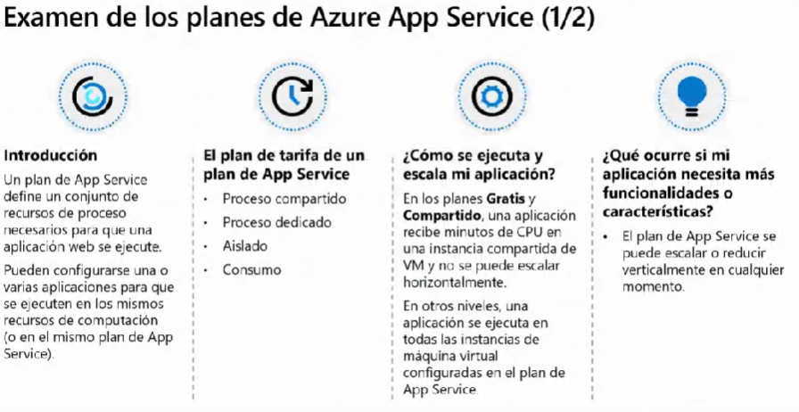

Muchos **Web Apps** pueden estar contenidos dentro de un mismo **App Service Plan**, aunque puede haber problemas si abusamos. Lo mismo con las **Azure Function**

Un plan de **App Service define un conjunto de recursos de proceso para que una aplicación web se ejecute**

Cuando se crea un plan de App Service **en una región determinada**, se crea un conjunto de **recursos de proceso para ese plan en dicha región**. Todas las aplicaciones que coloque en este plan de App Service se ejecutan en estos recursos de proceso según lo definido por el plan de App Service

## Cada plan de App Service define:
- Región (oeste de EE. UU., este de EE. UU., etc.)
- Número de instancias de VM
- Tamaño de las instancias de VM (pequeño, mediano, grande)
- Plan de tarifa (Gratis, Compartido, Básico, Estándar, Premium, PremiumV2, PremiumV3 y Aislado)

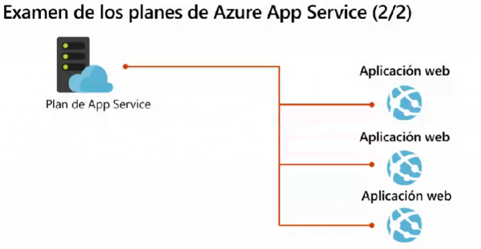

## El SDLA de nuestra solución (IMPLEMENTACIÓN)

Hay varios "caminos" para compilar el código del repositorio y llevarlo a mi App Service, aunque lo lógico es **hacerlo de una forma automatizada**. Lo ideal es que sea compilado en la nube con herramientas como **Azure DevOps** y demás antes mencionados para verificar que puede ser compilado en cualquier ordenador al margen del equipo o máquina que use el desarrollador (**que pueda tener instalados paquetes que el resto de usuarios finales no**)

También llamado **CI CD (Contincontinuous integration and continuous delivery)** ya que todo el **SDLA** se produce en la nube

## Ranuras de implementación

El uso de **ranuras de implementación** permite que los usuarios sigan utilizando la solución sin interrupciones de actualización exponiendo un **duplicado temporal de la solución** durante el transcurso de la actualización para que sea consumida en su lugar

Siempre que sea posible, use ranuras de implementación al implementar una nueva compilación de producción. Cuando se usa un nivel de plan de App Service Estándar o superior, puede implementar la aplicación en un entorno de ensayo y, a continuación, intercambiar los espacios de ensayo y producción. La operación de intercambio prepara las instancias de trabajo necesarias para que coincidan con la escala de producción, lo que elimina el tiempo de inactividad.

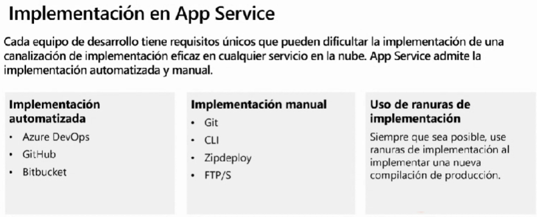


## Autenticación y proveedores 

Es posible añadir un **factor de autenticación** a nuestra App Service para la que el **usuario o programa** que quiera usar mi aplicación tenga que pasar por un **proveedor de autenticación** (ya que se hace de forma externa y este retorna la información a mi app)

También se puede especificar un comportamiento de **autorización** para otorgar permisos y que dependiendo de este, mi solución se muestre de una forma u otra, o que permita o no ciertos comportamientos

**Azure tiene autenticaciones integradas** que sin necesidad de que nosotros administremos, se comunican con los **proveedores**

- Proveedores que se encuentran de **forma predeterminada** en la plataforma:
    - **Plataforma - Punto de conexión**
    - Microsoft - `/.auth/login/aad`
    - Facebook - `/.auth/login/facebook`
    - Google - `/.auth/login/google`
    - Twitter - `/.auth/login/twitter`

(Cuando habilita la autenticación y autorización con uno de estos proveedores, **su punto de conexión de inicio de sesión está disponible** para la autenticación de usuarios y para la validación de tokens de autenticación del proveedor. Se puede proporcionar a los usuarios cualquier número de estas opciones de inicio de sesión)

## Funcionamiento

El módulo de autenticación y autorización se ejecuta **en el mismo espacio aislado que el código de la aplicación**

Cuando está habilitado, **cada solicitud HTTP entrante** pasa a través de él **antes de que el código de la aplicación lo controle**

Este módulo **controla varios aspectos de la aplicación**:

- Autentica a los ususarios con el proveedor especificado

- Valida, almacena y actualida los tokens

- Administra la sesión autenticada

- Inyecta información de identidad en los encabezados de la solicitud

> NOTA: el módulo **se ejecuta por separado del código** de la aplicación y se configura mediante **parámetros de la aplicación. **No se necesitan SDK, idiomas específicos o cambios en el código**

> NOTA: En **linux y los contenedores**, el módulo de autenticación y autorización se ejecuta en un **contenedor independiente** aislado de la aplicación. Puesto que no se ejecuta en proceso, **no es posible la integración directa con plataformas de lenguajes específicas**

## Flujo de autenticación

Es el mismo **para todos los proveedores**, pero varía en dunción de si queremos **iniciar sesión con el SDK del proveedor**

## Porqué usar la autenticación integrada

La característica de autenticación integrada para App Service y Azure Functions **puede ahorrar tiempo y esfuerzo**, ya que proporciona autenticación integrada con **proveedores de identidades federados**, lo que le permite centrarse en el resto de la aplicación

- Azure App Service le permite integrar numerosas funcionalidades de autenticación en su aplicación web o API sin implementarlas usted mismo

- Está integrado directamente en la plataforma y **no requiere ningún idioma, SDK, experiencia en seguridad** ni ningún código en particular

(Existen otros con los que podemos autenticar y que también se basan en **OAuth o Open Authoritation**, que es un **estándar abierto** que define cómo, de forma segura, se debe realizarse la autorización de una API para aplicaciones web, móviles o de escritorio)

Es posible **configurar el App Service para que pueda utilizar otros proveedores** que cumplan con el **OAuth**, dando la opción a los usuarios de que se idenfiquen mediantes otras plataformas

Azure App Service permite esta configuración de forma **automática y más rápida que de la manera convencional**

La autenticación se lleva a cabo **mediante cookies** que transmiten la información de forma **Segura** mediante el proveedor y nuestra Web App

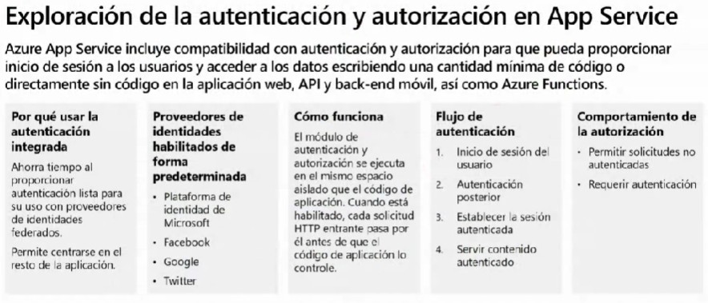

Las **conexiones híbridas** permiten a nuestra aplicación web trabajar con **bases de datos que por motivos de seguridad, políticas u otros se encuentren On-premise** (No está disponible en todos los **planes de SKU**)

Las **conexiones híbridas** hacen de nuestra aplicación **multiinquilino**

Son **similares a las Data Gateway de PowerPLatform** con la principal diferencia de que estas se conectan mediante **conectores ya existentes y definidos**, mientras que las conexiones híbridas **nos permiten definir de qué forma conectar la aplicación a la base de datos On-premise**

En la App Service se puede controlar el acceso **mediante determinadas APIs o VPNs (filtrándo cuáles pueden acceder)** e incluso controlar las
**salidas de datos** de mi aplicación

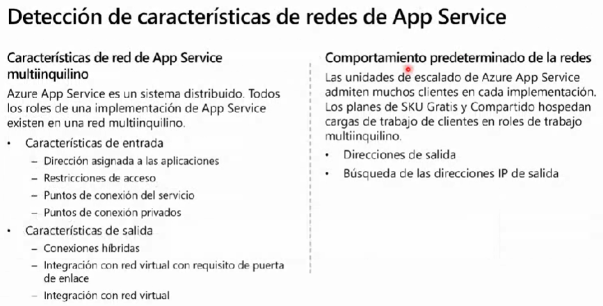

>> [Vuelve al Índice o vete a dar una vuelta](#índice)😎

# Módulo 1

# (Creación de aplicaciones web (PARTE II))

>>`<Clase del 30/06/2022>`

La facturación no depende del **App Service**, sino del **App Service Plan**

Esta depende del **tiempo que yo tenga activo el App Service Plan**, que significa **el tiempo que el o los App Services se encuentran trabajando en peticiones**

## Configuración de la aplicación

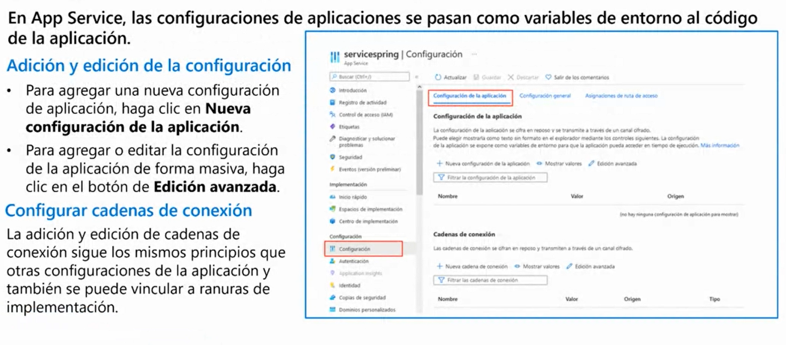

El que las **configuraciones de las aplicaciones** se pasen como **variables de entorno al código de la aplicación**, ayuda a que los cambios sean más **sencillos** además de **generales**

Los **valores pueden ser modificados facilmente desde el Azure Portal** y que dichos cambios afecten directamente en **el código de la aplicación asociado** y con él su comportamiento

Esto también ayuda a que **los valores estén protegidos** ya que no se muestran en el código sino que son referenciados

>NOTA: los entornos en este contexto hacen referencia al entorno de desarrollo y de producción; una variable solo puede ser accedida en el contexto de su entorno

>NOTA: por otra parte, puedo tener una variable en cada entorno con el mismo identificador pero distintos valores

## Cadenas de conexión

Es una **cadena que contiene información cifrada acerca de una fuente de datos** (generalmente un motor de base de datos), además de incluir la información necesaria para **conectarse a la misma**

## Edición de la configuración de forma masiva

La **configuración de la aplicación** también puede realizarse directamente mediante **formato JSON**, especificando todas las variables de una sola sentada, ya que internamente la configuración se registra en este mismo formato

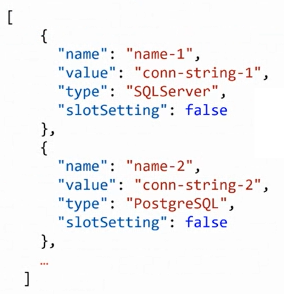

## Otras configuraciones

Otras posibles configuraciones serían:

- **La pila**: la tecnología o framework que usa internamente la aplicación (pila de software). Podemos definir el lenguaje que queremos usar y la versión del SDK

- **La plataforma**: la arquitectura del sistema en el que quiero que se ejecute mi aplicación, el protocolo de Websocket, si queremos que el "Always On" esté o no activo, ...

- **La depuración**: habilitar o no la depuración remota, es decir, la depuración desde un herramienta de desarrollo (como Visual Studio) en un equipo local (en un entorno de producción, es peligroso tenerlo habilitado porque puede causar problemas)

- **Certificados de clientes**: podemos exigir que las peticiones vayan acompañadas de un certificado para verificar al usuario o servicio que la solicita (una forma de asegurar la autenticación)

>NOTA: Un certificado SSL es un certificado digital que autentica la identidad de un sitio web y habilita una conexión cifrada. La sigla SSL significa Secure Sockets Layer (Capa de sockets seguros), un protocolo de seguridad que crea un enlace cifrado entre un servidor web y un navegador web

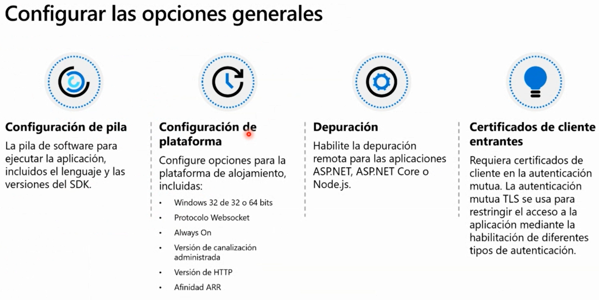

Si no tenemos el **"Always On" activo**, cada vez que resuelve una petición, **se desactiva** la aplicación web lo que hace que al recibir una nueva petición, **tarde un poco más** en volverse a activar antes de resolverla

>NOTA: lógicamente el "Always On" hace que la facturación se incremente y en planes como el gratis no tiene sentido activarlo, pero en aplicaciones de producción es recomendable ya que otorga al servicio o usuario que realiza la petición, la respuesta que necesita inmediatamente

## Configuración de las rutas de acceso (url)

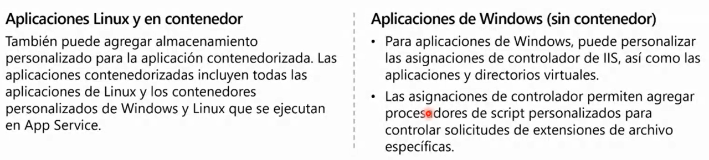

## Habilitar registros de diagnóstico

Un **registro de diagnóstico** hace referencia a un fichero (**log**) que registra **todo lo que ocurre en nuestra aplicación** (peticiones atentidas correctamente, peticiones falladas, peticiones de recursos inexistentes, ...)

Este **log** nos permite comprobar el **funcionamiento de nuestra aplicación e incluso ayudar a solucionar un determinado problema**

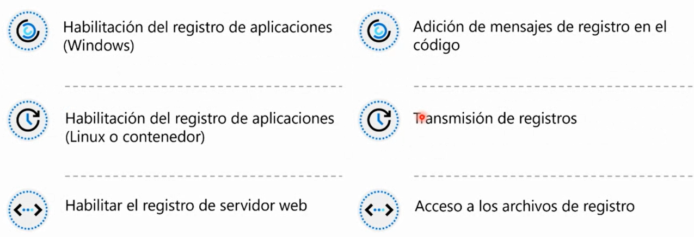

>NOTA: la diferencia entre un resgistro de aplicación y web es que este último registra todo referente al tráfico web, mientras que la aplicación todo lo referente a esta internamente (se ha creado un pedido, se ha modificado el script, se ha creado una nueva función, ...)

Ese registro que se va **creando y guardando en el disco duro del servidor**, lo puedo trasnmitir a un **entorno más perdurable**

Porque si lo guardo en el equipo donde se está ejecutando, es posible este tenga un problema, **Azure lo reinicie y se pierdan los logs**

Si consideramos necesarios los logs, es **importante volcarlos en algún sitio** que nos asegure que no van a desaparecer

## Configuración certificados de seguridad

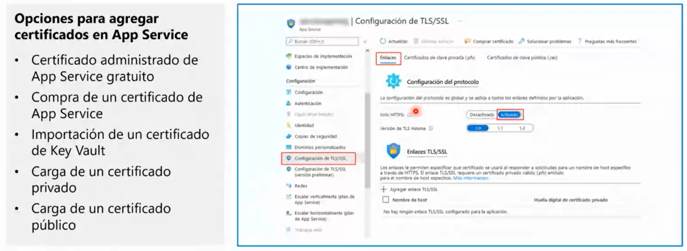

Podemos utilizar el **Certificado gratuito** que nos da Azure por **defecto** o comprar otro distinto en el mismo portal o a otro proveedor e integrarlo dentro de la web app

## Administración de las características

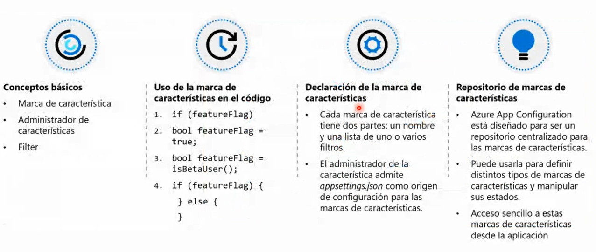

Se puede administrar la forma en la que se **comporta nuestra app** mediante **características** (ejemplo: solo se pueden crear pedidos durante el día y si se trata de crear uno por la noche, le aparece un error al ususario)

Un uso bastante común de las características, es para **probar nuevos recursos o diseño de la aplicación cuyo éxito no conocemos con seguridad** (ejemplo: habilitar que solo las personas de New York puedan acceder a una parte de prueba de mi aplicación para saber si será bien recibida antes de habilitarla para el esto de países)

En general el uso que se le da a las características es para **pruebas de conceptos de nuevas funcionalidades en diferentes partes del mundo**

## Qué es un protocolo de enlace TSL

Es un **protocolo de encriptación** diseñado para **proteger las comunicaciones en internet** 

Es el protocolo en el que se basa **HTTPS** para establecer un canal de comunicación encriptado y privado entre el usuario o servicio y la aplicación web (en caso de que alguien pueda acceder a la información, no podría descifrarla)

>> [Vuelve al Índice o descansa y tómate un algo](#índice)😎

---
---
---

# Módulo 1

# (Creación de aplicaciones web (PARTE III))
>>`<Clase del 30/06/2022>`

## Escalado de aplicaciones


>> [Vuelve al Índice o vete de fiesta un rato](#índice)😎

---
---
---

# Módulo 2
# (Implementación de Azure Functions)
>>`<Clase del 01/07/2022>`

## Qué es un Azure Function

[Enlace a documentación Microsoft](https://docs.microsoft.com/es-es/azure/azure-functions/functions-overview)

Es una solución que permite escribir menos código, mantener menos infraestructura para ahorrar costos. En lugar de preocuparse por implementar y mantener servidores (**Serverless**), la infraestructura en la nube proporciona todos los recursos actualizados necesarios para mantener las aplicaciones en ejecución

Como desarrolladores, nos centramos en los fragmentos de código que importan y Azure Functions se ocupa del resto de forma secundaria

En definitiva, permiten que se ejecute **una determinada lógica ante una acción que ocurra**

Cada Azure Function debe tener por fuerza **un desencadenador**

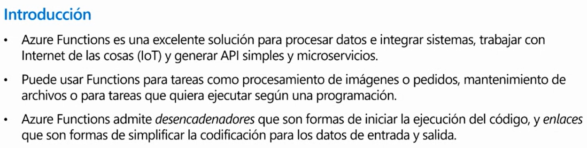

- Ejemplos de uso:

    - *Integrar sistemas*: es decir, **comunicación entre distintos sistemas** mediante pequeños trozos de código sin tener que levantar proyectos completos de desarrollo o máquinas virtuales (**una funcionalidad muy concreta**)
    
    - *IoT o Internet de las cosas*: para realizar la **comunicación vía internet con dispisitivos** o electrodomésticos por ejemplo, ya sea para supervisar u ordenar

    - *Implementación de microservicios*: en lugar de tener un proyecto gigantesco, **separo el código en pequeñas partes cada una con una funcionalidad** (estas últimas serían funcions) y permiten una actualización modular/alta tolerancia a fallos

    - *Procesamiento de imágenes o pedidos*: para **comprimir imágenes o lo que se considere** necesario según el caso

    - *Desencadenadores*: pueden ser utilizadas como **triggers** que desencadenen sucesos

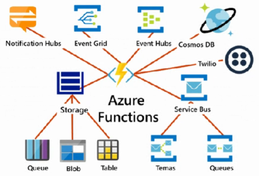

## Qué es Azure Logic App


Utiliza conectores para llevar a cabo un flujo de trabajo que le especifiquemos

## Qué es WebJobs

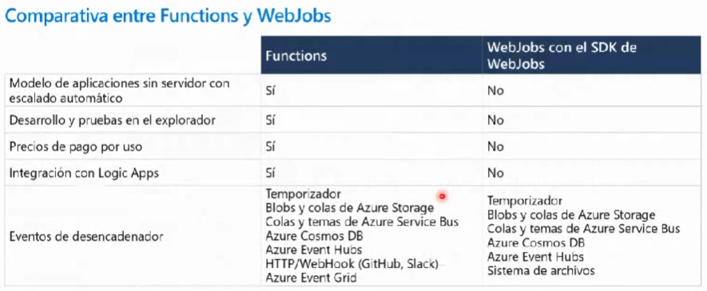

Permite meter una pequeña funcionalidad que se ejecute cada cierto tiempo o ante cualquier determinada situación **dentro de una aplicación web .NET**

## Hospedaje de Azure Functions

Tarifas de planes según la carga de trabajo que tenga que sorportar nuestra App Service:

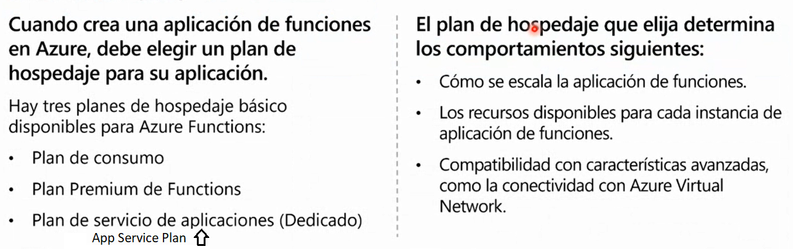

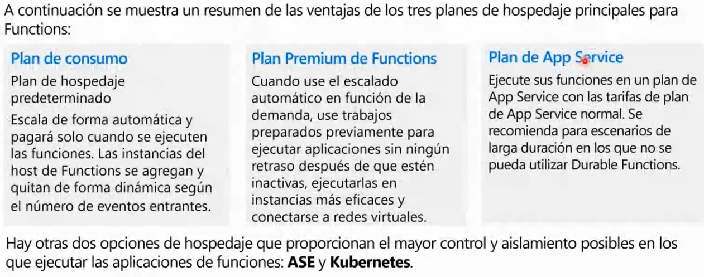

**Plan de Consumo**: tarifa predeterminada que se encarga de escalar los recursos (sin tener nosotros que definir el cómo se escala, ya que es el mismo Azure el que decide según la situación) en función de las llamadas que reciba por parte de los usuarios. Tomará más recursos cuando los necesita y los reducirá cuando no sean requeridos de forma dinámica

**Plan Premium**: también funciona bajo demanda pero tiene unas caracterísiticas más avanzadas que el plan de consumo. No tiene **retardo inicial** en responder a las llamadas ya que siempre está preparado para devolver la información necesaria

**Plan de App Service**: colgamos la Azure Function **como si fuera una App Service más**, y esta escalará o desescalará en función de la carga global que tenga el App Service

**RESUMEN**: En el plan de **consumo** y en el **premium**, es Azure quien decide el escalado según el consumo mediante un **controlador de escala** (en función del número de eventos, del consumo de recursos, el número de instancias, etc)

---

Si elegimos la tercera tarifa, el Plan App Service:

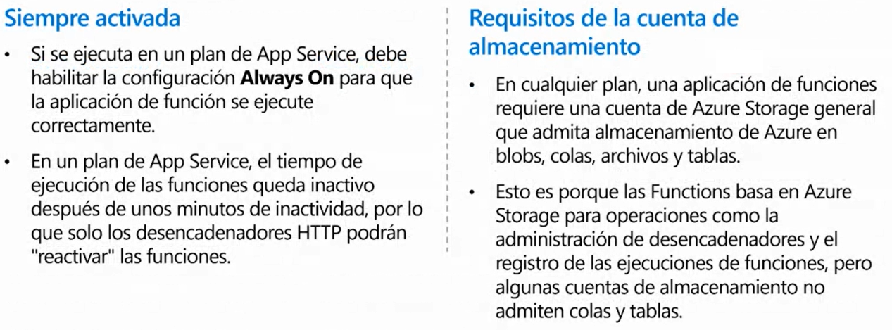

Si no configuramos el **Always On**, la App Service solo empezará una función tras un desencadenante (en algunos casos, puede no ser necesario; dependiendo de los requisitos)

Las Azure Functions pueden **necesitar cuentas de almacenamiento** para guardar información de seguimiento, de sincronización, de seguridad o de determinadas cosas que se requieran

## Escalado de Azure Functions


Evidentemente, podemos configurar el **número de instancias máxima** (llamadas o solicitudes) por segundo para que el servicio no colapse o se dispare el costo

El escalado se mide mediante el **número de instancias**, no de la **potencia**

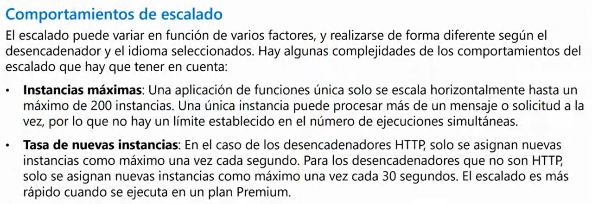
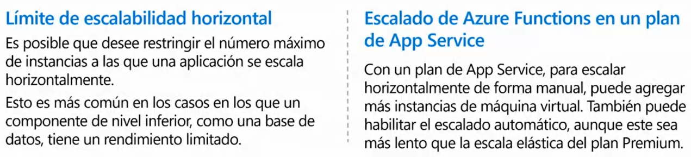

## Partes de un Azure Function

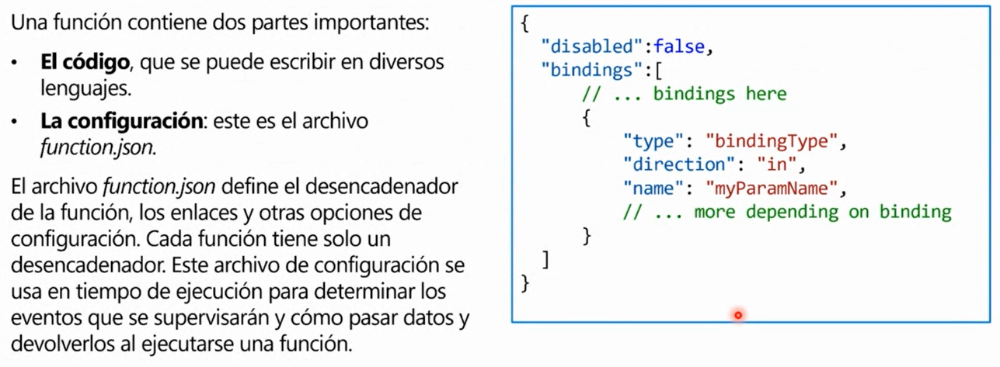

En nuestros proyectos **.NET**, además de un **.exe** o un **.dll**, debemos tener un fichero **json con la configuración** que defina la **Azure Function**

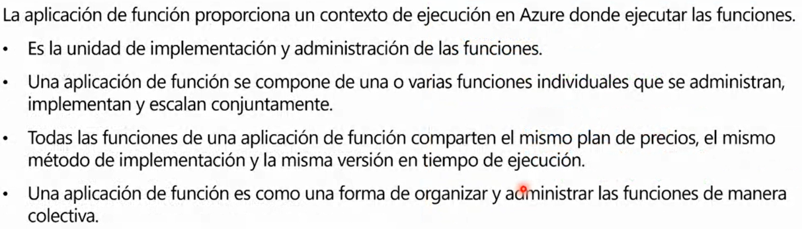

**Azure Function** ofrece un **contexto de ejecución**, al igual que cuando ejecutamos una aplicación de escritorio tenemos el contexto de un sistema operativo. Esto quiere decir que, entre nuestra Azure Function y nuestro sistema operativo, se generan una **serie de funcionalidades** cuando **levantamos** nuestra Azure Function relacionadas con su finalidad y que ayudan a que esta se lleve a cabo. La duración de estas funcionalidades termina con la finalización del propósito del Azure Funcion (componentes configurados para permitir el objetivo de la function que nacen y mueren junto con esta)

**Todas las funciones** que se encuentran dentro de **un mismo proyecto, comparten el mismo plan de precios** por fuerza. También comparten **métodos de implementación e incluso la misma versión de tiempo de ejecución**

Esto sirve para **administrar las Azure Functions de forma conjunta**

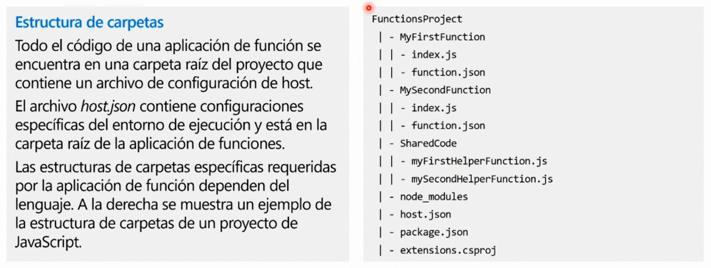

Azure Function no solo es compatible con **.NET**

También lo es con **Node.js o Python** por ejemplo; es un servicio abierto a todo tipo de lenguajes y frameworks

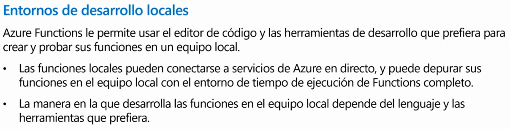

Las **Azure Functions** permiten a los desarrolladores trabajar en nuestro equipo con nuestras herramientas elegidas y luego conectarlas con **Azure cuando sea necesario**

Es decir, tenemos la opción de **desarrollo local o en la nube** (es importante recordar que la compilación debe llevarse a cabo en la nube para evitar el problema antes mencionado sobre los paquetes del equipo local)

## Creación de desencadenadores y enlaces

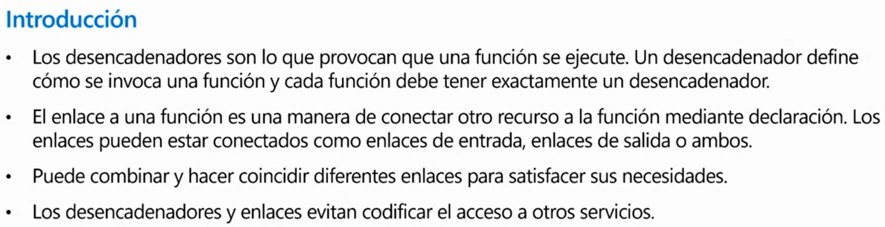

El concepto es prácticamente el mismo que con los **triggeres** (un conector configurado), excepto que en el caso de las **Azure Function** el desencadenador es a **nivel de código** 

En dicho código, se define **cómo se invoca ese desencadenador** y **cada función debe estar relacionada con un desencadenador** que la haga ejecutarse)

No se puede tener un **Azure Function** sin un desencadencadenador

---

También podemos tener **enlaces o bindings** que nos permite **vincular una función con un determinado recurso (cola de almaceamiento, tabla de storage, blob storage, base de datos,...)**

Estos **enlaces pueden ser de entrada, salida o ambos**

Los enlaces sirven para **simplificar el código para determinar qué va a ocurrir** (si quiero tener una determinada función que se dispare cuando un usuario introduzca un fichero en un blob, necesito conectarme con ese blob para poder tener acceso a ese nuevo fichero; de la forma tradicional, sería necesario un bloque de código para llevarlo a cabo; sin embargo, los **enlaces** simplifican el desarrollo ahorrando el código y sustituyéndolo con variables relacionadas que permiten el acceso de forma **simplificada**)

Yo puedo tener en una misma **Function** varios **enlaces**

## Definir desencadenadores y enlaces

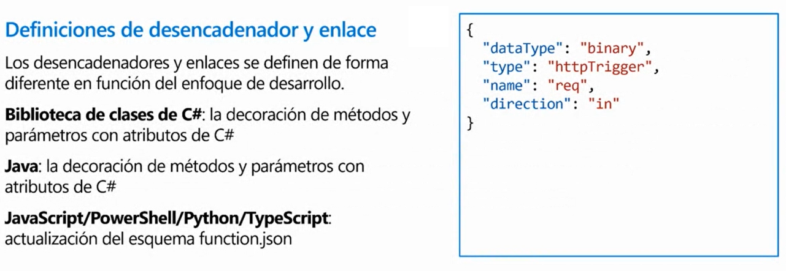

En el caso de **bibliotecas de C# y Java**, se definen mediante **atributos** (métodos y parámetros)

En el caso de **JavaScript/PowerShell/Python/TypeScript**, se definen dentro del **fichero JSON** como en el ejemplo de la imagen 

Es decir, en el caso de **.NET y Java**, no va a ser necesario que toquemos ni redactemos el fichero **JSON** ya que van a ser las mismas herramientas del framework las que se encargaran de crearlo y configurarlo (aunque hay que tener en cuenta que el fichero existe dentro del proyecto y se define automáticamente a raíz del código que diseñemos)

(Si sería necesario tocarlo en **los demás frameworks** como se expecifica arriba)

## Dirección de enlaces

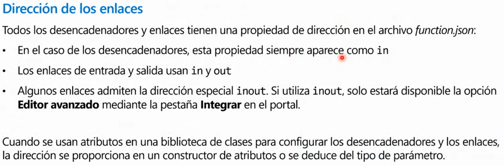

Los enlaces permiten **vincular** nuestras Azure Functions con algunos **servicios de Azure**

La vinculación puede ser de **entrada, salida o ambas** (in, out o inout)

**RESUMEN: desencadenador (desencadena la funcón) y enlace (lo que necesita la función para llevar a cabo su objetivo)**

## Ejemplo 1
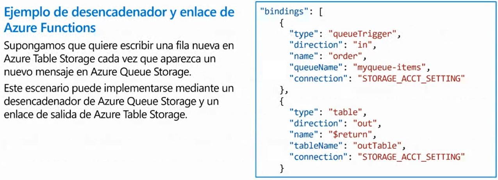

Este es un ejemplo de uso disparador/enlace (aquí vemos un JSON)

En el caso de la imagen **Azure Queue Storage** es el desencadenador y **Azure Table Storage** el enlace o binding, lo que significa que cada vez que alguien introduzca información en la **Queu Storage**, va a añadirse una fila en la **Table Storage**

**Azure Table Storage** es un servicio que nos permite guardar información de forma **tabular** (como una hoja de excel)

## Ejemplo 2
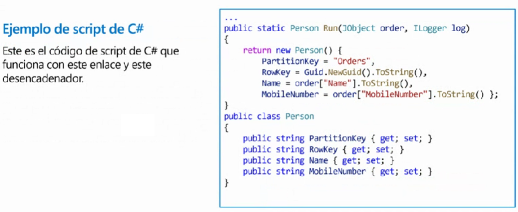

Otro ejemplo de uso disparador/enlace en C# (aquí no es necesario configurar el JSON ya que este se crea automáticamente según el código que especifiquemos, por lo que en el ejemplo analizamos el código C#)

## Otros Ejemplos

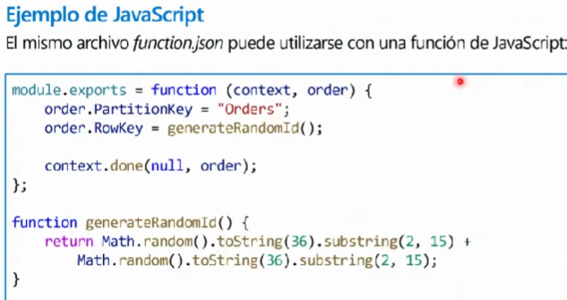
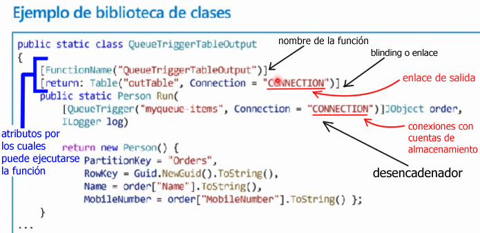

## Conexiones con cuentas de almacenamiento

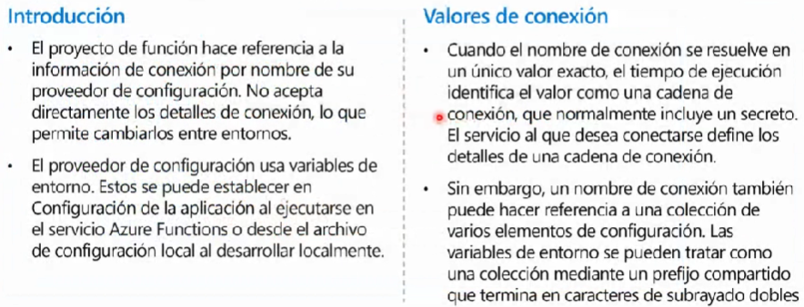
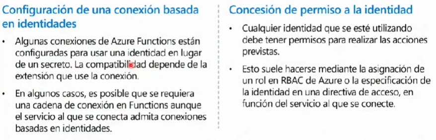

> **NOTA: el concepto de identidad se explica más adelante junto al tema de seguridad**

## Examinando código


Una **Queue o cola** es una serie de mensajes apilados que al ser recibidos y cumplir con su función, desaparecen

Si el **mensaje de la cola** intenta su cometido tres veces sin conseguirlo, pasa a una **poison queue**

Cuando añadimos un mensaje a la **queue**, podemos indicarle el **tiempo de expiración**. Es decir, si después de dicho tiempo el mensaje no es leído, desaparecerá automáticamente

## Implementación de Durable Functions o Funciones Durareras

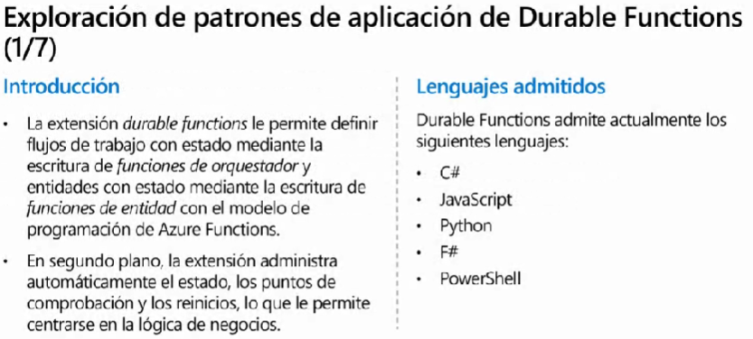

Un **patrón de diseño** es la definición de cómo resolver un problema mediante un programa

Las **Durable Function** son básicamente **Functions** cuyas ejecuciones son **durables en el tiempo** (es decir, que no se completen de forma instantánea, sino que necesita por ejemplo esperar respuestas o aprobaciones para finalizar)

Las **Durable Function**, para no ocupar recursos mientras sucede la espera, **se desactiva**

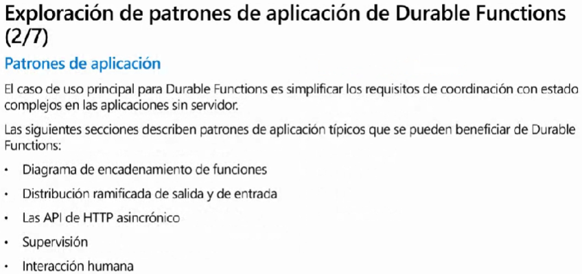


## Ejemplos de Patrones existentes:

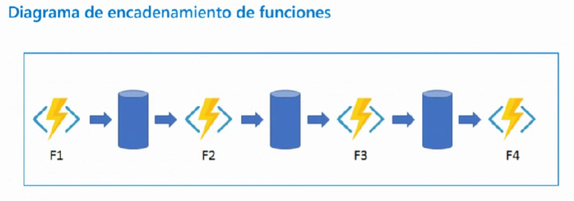


Ejemplo de procesamiento del pedido (PATRÓN DE FUNCIONAMIENTO):

    F1: ¿El cliente está al corriente de los pagos? Sí

    Almacenamiento: Guarda que está al corriente de los pagos

    F2: ¿Hay suficiente mercancía en el almacén? Sí

    Almacenamiento: Reserva la mercancía

    F3: ¿Está preparado el pedido?

    Almacenamiento: Sí, el pedido está prepadado

    F4: Llama a la empresa de mensajería para que venga a recogerlo

**Azure Durable Function** se encarga de que el ejemplo anterior funcione con coherencia

El **tiempo total** en este caso es la suma de los tiempos que tarda cada parte en acabar


Ejemplo de procesamiento de pedido EN PARALELO (pedido con mercancía de cada uno de los almacenes):
    
    La F1 consulta la existencia de la mercancía necesaria para realizar el pedido completo

    La F2 lanza una tarea a cada uno de los almacenes para que preparen el producto del pedido que les corresponde

    La F3 llama al servicio de recogida

El **tiempo total** en este caso la suma de los componentes que más tiempo tardan en cada fase, dado que el pedido no puede ser completado hasta que todas las partes han hecho su trabajo

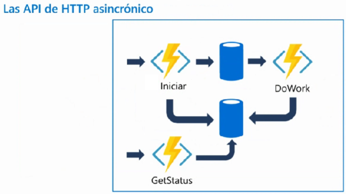

    En este caso, lanzo una función pero se habilita una opción para preguntar por el estado de dicha función


    En este caso, lanzo una función y compruebo su estado e incluso puedo llegar a cancelarla o pausarla


    En este caso, lanzo una Durable Function y esta espera a ser aprobada o denegada (se encuentra desactivada durante el proceso)

## Tipos de Durable Function

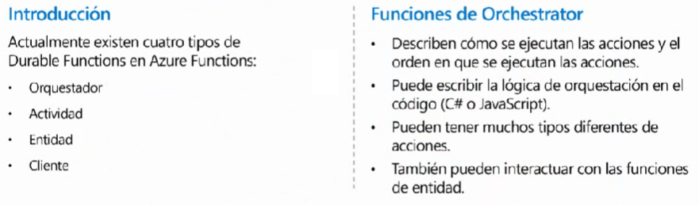

- **Función Orquestador**: se encarga de hacer que todo funcione

- **Función de Actividad**: las distinas functions que se ejecutan, los F anteriores

- **Función de Entidad**: los elementos con los que se comunican, donde se guarda la información

- **Función Cliente**: el que solicita la ejecución del proceso

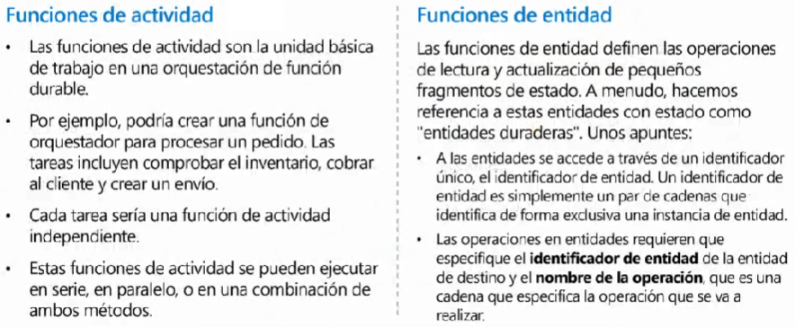

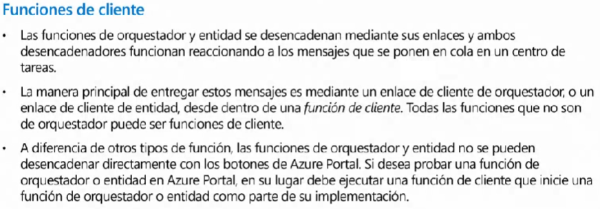

## Centros de tareas

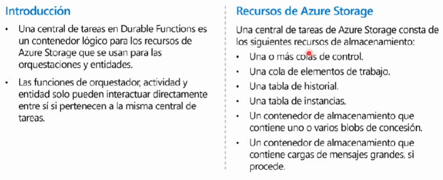

Dado que las **Azure Functions** se pueden alargar en el tiempo (**Durable Function**), es necesario algún tipo de almacenamiento de información

Cuando se queda pendiente de volver a ser activada, la información se guarda en el **Azure Storage** en el cual se encuentra el centro de tareas

En definitiva, **un centro de tareas**, es un conjunto de recursos de **Azure** necesarios para el correcto funcionamiento de las **Azure Functions**. Estos recursos son:

En el Azure Storage, se encuentra el centro de tareas cuyos recursos son:
- Una o más colas de control
- Una cola de elementos de trabajo
- Una tabla de historial
- Una tabla de instancias
- Un contenedor de almacenamiento que contiene uno o varios blobs
- Un conetenedor de almacenamiento que contiene cargas de mensajes grandes, en caso de que sea necesario

El nombre del **centro de tareas** se declara en el archivo **json**
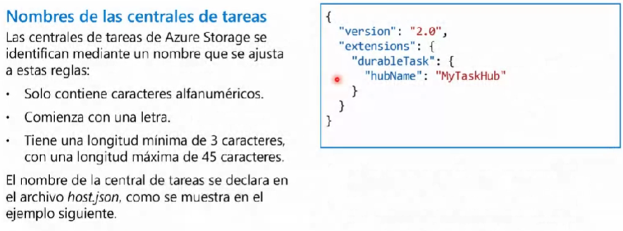

## Orquestador 

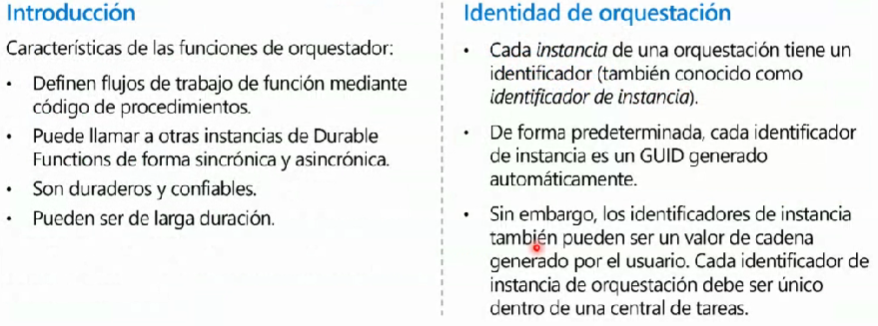

Cada orquestador tiene un **identificador único** por el cuál podemos buscar

Se encarga de concatenar los procesos

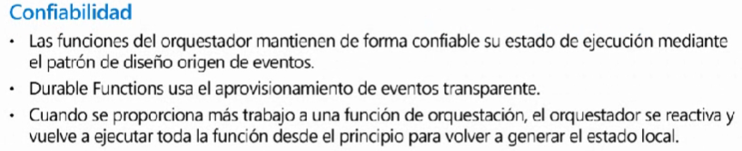

## Timer

Existen mecanismos por los que podemos hacer a la Durable Function deje de hacer nada durante un tiempo, pero sin consumir recursos

El orquestador genera un mensaje dentro del tiempo que queramos, que reactive la durable function

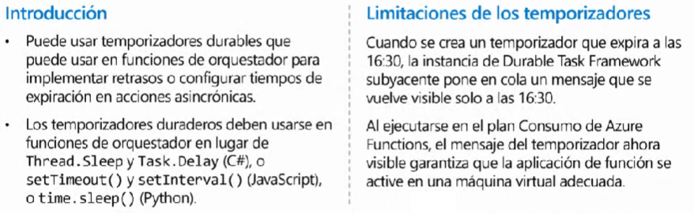

## Cómo se lleva a cabo dicha espera:

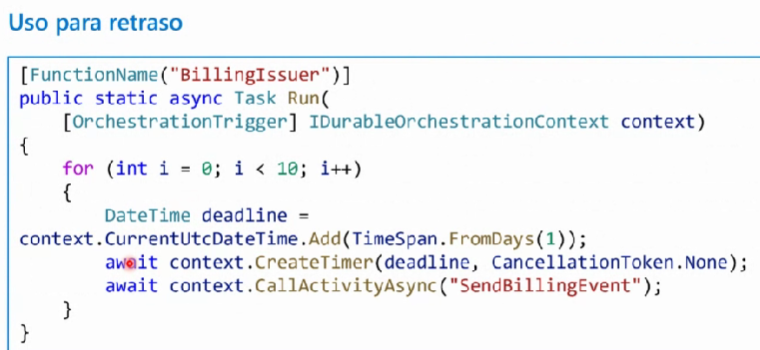


## Otro ejemplo sería que en lugar de esperar un tiempo o que termine un trabajo, espere una aprobación:

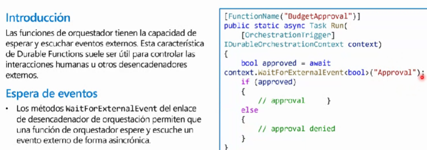

## Esperar a eventos externos:
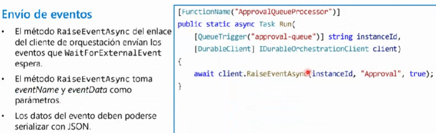

>> [Vuelve al Índice o date una ducha fría](#índice)😎

---
---
---

# Módulo 3: 
# (Desarrollo de soluciones que usan Blob Storage)
>>`<Clase del 04/07/2022>`

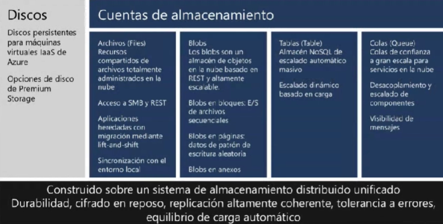

Las cuentas **Azure Storage** internamente tienen una serie de **subservicios**:
- Archivos **(File Storage)**
- **Blob Storage**
- Tablas **(Table Storage)**
- Colas **(Queue Storage)**

Hay otro **Servicio de almacenamiento llamado Discos**, pero hacen referencia a los discos que utilizamos para levantar máquinas virtuales

## Tipos de Blob

- Basados en **bloque** (Block Blob)
- Basados en **páginas** (Page Blob)
- Basados en **anexos** (Append Blob)

## Tarifas de las Azure Storage

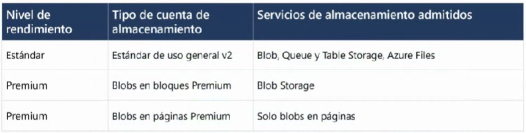

## Esquema de un Azure Storage (para los sistemas BLOB)

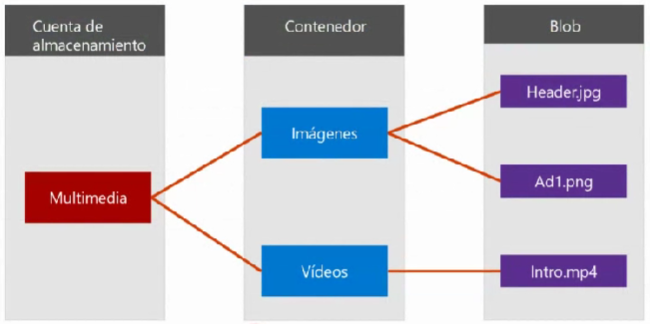

## Seguridad en un Azure Storage 

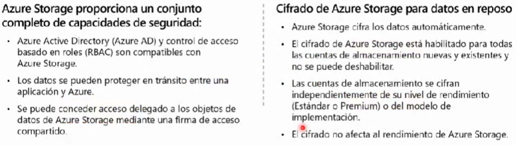

La seguridad a **nivel global** en Azure está basada en **Azure Active Directory (AD)**, que se encarga de comprobar los permisos mediante **Control de Acceso Basado en roles (RBAC)**

Dado que mediante el uso de Azure Storage, se produce **tránsito de datos (descarga o subida)**, estos se protegen mediante **cifrado**

El **cifrado** no se puede desactivar y está activo para **todos los datos independientemente del plan de servicios**

## Redundancia en Azure Storage

Redundancia primaria:
- Redundancia local **LRS**: Replica de los datos en **tres sitios** distintos **dentro del mismo centro de datos**
- Reduncia de zona **ZRS**: Replica de los datos en **las otras zonas disponibles de la región**

Redundancia secundaria:
- Redundancia geográfica **GRS**: Replica **LRS** de los datos en **otra geografía**
- Redundancia de zona geográfica **GZRS**: Replica **LRS** de los datos **en otras zonas disponibles de la región, además una réplica extra en otra geografía**

> NOTA: Las **redundancias secundarias** SOLO PERMITEN LEER, **no escribir** (Si mi sistema principal cae o es destruido, puedo recuperar los datos de la redundancia secundaria, pero no podría modificar los datos de allí)

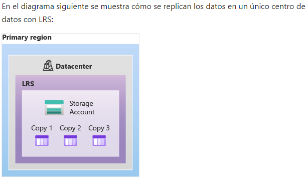
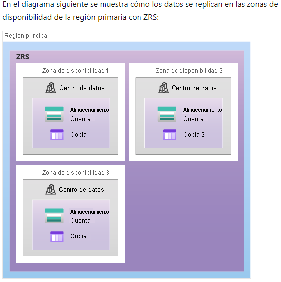
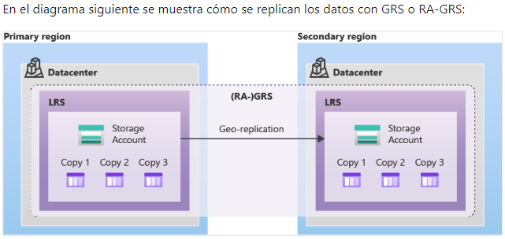
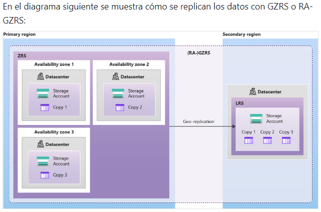

[Enlace a documentación Microsoft](https://docs.microsoft.com/es-es/azure/storage/common/storage-redundancy)

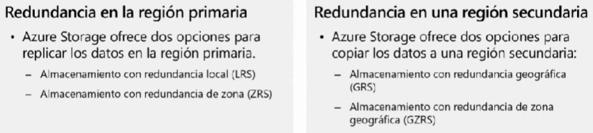

## Exploración del ciclo de vida

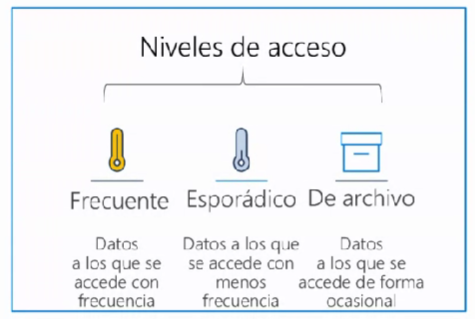

Dependiendo de **la frecuencia con la que se accede a los datos**, elegimos diferentes **niveles de acceso** para nuestro Blob Storage que difieren en **latencia y costo**

Estos niveles o **lyfe cycle policies** son:
- Frecuente (HOT)
- Esporádico (Cool)
- De Archivo (Archive)

> NOTA: solo las cuentas de **propósito general v2 (GENERAL PURPOSE V2)** soportan las políticas del ciclo de vida

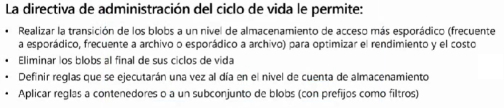

Las **directivas de administración del ciclo de vida** son en definitiva:
- La elección del tipo de **nivel** (**frecuente (HOT), esporádico (Cool) o de archivo (ARCHIVE)**) y el **intercambio entre estos** según vaya necesitando el almacenamiento (según cambie la frecuencia de uso)

- La eliminación del almacenamiento al final de su ciclo de vida o uso (**muere**)

- Definir una **serie de reglas** que se ejecutan **una vez al día como mínimo** y que decicen lo mejor para el uso de dichos ficheros
(ejemplo, si tengo un servicio cuyo acceso a ciertos archivos crece de pronto, una regla detectará esta anomalía y cambiará de nivel el almacenamiento para que los usuarios reciban los datos con mayor rapidez)


> NOTA: Por defecto, el almacenamiento se encuentra en el nivel **frecuente**
> NOTA: Puede realizarse la transición de información entre niveles en cualquier momento como si de un escalado de recursos se tratase

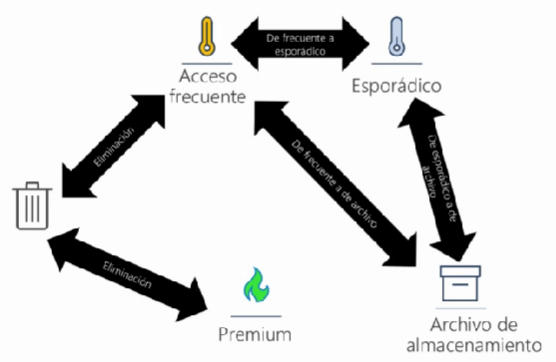

## Directivas

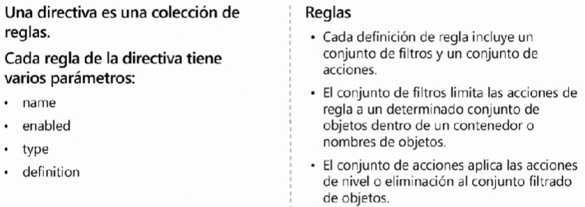

Una **directiva es un conjunto de reglas** y cada una de estas tiene a su vez **un conjunto de filtros y acciones**

Una **ruta** es la **url con la que accedo a la información en almacenamiento**
(ejemplo, https://cuentadealmacenamiento.blob.core.windows.net/carpeta/imagenes/ficheroenelblob.png)

Un **Filtro** define la ruta a la cual afecta **una determinada regla**
(ejemplo, en la ruta anterior, puedo ordenar mediante el filtro que la regla afecte al contenido que se encuentre dentro de la **carpeta**; es decir, a todos los ficheros que se encuentren dentro de la ruta https://cuentadealmacenamiento.blob.core.windows.net/carpeta/...)

Las **acciones se aplican al conjunto filtrado de archivos o ficheros** antes mencionado. Todos los **objetos que se encuentren dentro de la url filtrada**, se comportaran según la **regla especificada** (ejemplo, los objetos del filtro visto arriba, se guardarán en nivel esporádico)

## Cómo se definen las reglas de un ciclo de vida

Se definen mediante un **JSON**

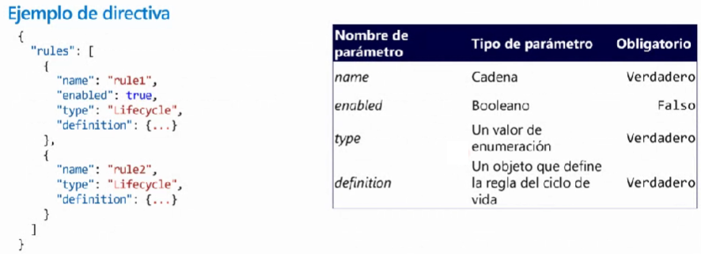
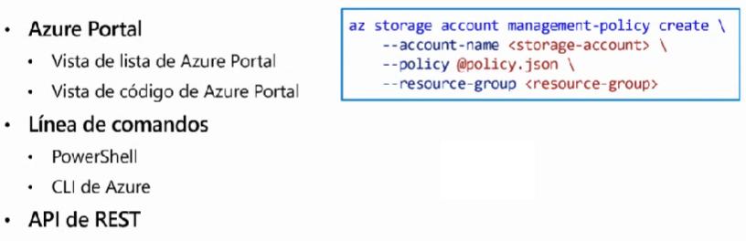

Los **parámetros para definir una directiva son**:
- name
- enable
- type
- definition

Este tipo de **implementación se lleva a cabo en Azure CLI o en el PowerShell**

## Rehidratación de un Blob

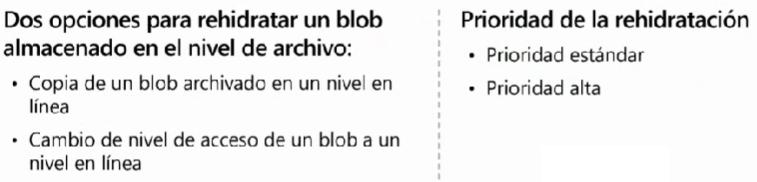

Los **archivos** que se encuentran en el **nivel archivo o arquive** (el nivel más bajo), necesitan ser **rehidratados** para poder ser accedidos de nuevo

## Bibliotecas de Azure Storage

Las **clases de .NET** para interactuar de una forma más fácil con el Azure Blob Storage

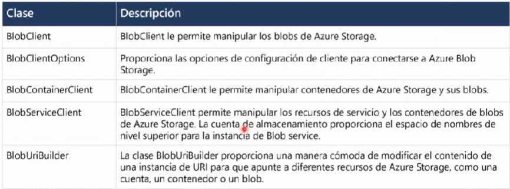
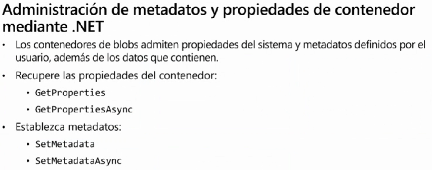
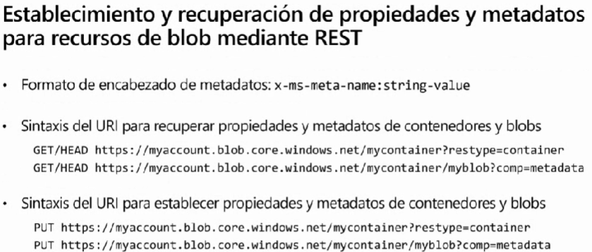

> NOTA: Las propiedades se pueden recuperar mediante el uri solo si el contenedor es público

>> [Vuelve al Índice o tómate un café por dios](#índice)😎

---
---
---

# Módulo 4: 
# (Desarrollo de soluciones que usan Azure Cosmos DB)
>>`<Clase del 05/07/2022>`

## Principales ventajas de Azure CosmoDB

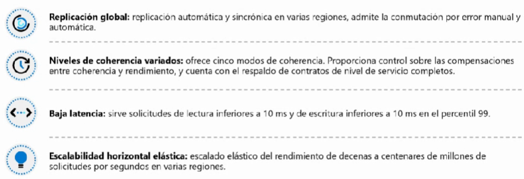
Pretende dar solución a la necesidad de bases de dato **NoSQL** (no sequencial), ya que dentro del porfolio de recursos que ofrece Azure, ya están cubiertas las bases de datos **SQL** mediante otros servicios

**Azure CosmosDB** es una marca en la cual se engloba **tecnología NoSQL** que comparten ciertas características:
- **Replica Global automática** en varias regiones en Azure (en caso de error de cualquier tipo, podemos programar manual o automáticamente que se produzca una conmutación, es decir, que el sistema salte automáticamente a otra región para que no se produzca interrupción en mi servicio)
- **Niveles de coherencia variados**, dado que los datos se encuentran replicados como se menciona anteriormente, deben estar todos actualizados para poder ver la misma información. Esto es denominado **coherencia** en cuanto a bases de datos y podemos elegir **el nivel** que 

- **Baja latencia** asegurada, medida de tal forma que las solicitudes de **lectura y escritura de información, son inferiores a 10ms**

- **Escalabilidad horizontal elástica** al igual que en otros servicios, automáticamente me concede más potencia si lo necesitamos

## Jerarquía de recursos de CosmosDB

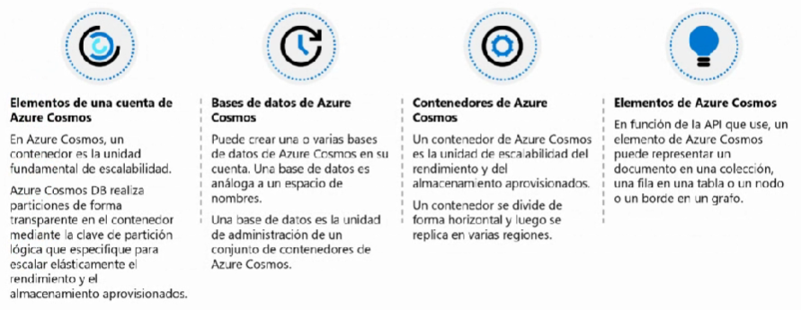

1. Primero es necesario tener **una cuenta de Azure Cosmos**
- **Azure Cosmos es el servicio como tal** y nos va a permitir establecer una configuración que especifique la forma de uso que vamos a hacer de este

2. Es posible crear **una o varias bases de datos** en la cuenta de **Azure Cosmos** (una analogía de un **namespace** y una **unidad de administración para todos los contenedores desplegados dentro de esa base de datos**)

3. Varios servicios en Azure se denominan **Contenedores**, pero estos son diferentes unos de otros. En este caso son **Contenedores de Azure CosmoDB**, la **unidad de escalabilidad, del rendimiento** y del  **almacenamiento** (a raís de ellos vamos a poder medir el rendimiento de Azure CosmosDB y va a significar el coste de lo que aprovisionemos; Si queremos más potencia, **aumentamos el rendimiento DEL CONTENEDOR**)

4. En **función de la API** que se use (la tecnología con la que despleguemos la cuenta), **los elementos de Azure Cosmos** pueden ser **documentos** en una colección, **filas** en una tabla, un **nodo** o un **borde en un grafo** (dicha tecnología no puede ser modificada una vez creada, pero sí podemos crear otras cuentas de **Azure Cosmos** con otras distintas)

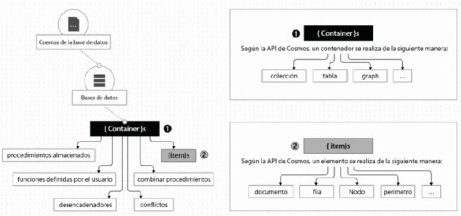

```
     Cuenta de Azure Cosmos
               |
         Base de Datos
               |
           Contenedor
               |
  Colección, tabla, grafo, ...
               |
Elementos (documentos, filas, ...)
```

**Adicionalmente** el container almacena otros datos como **procedimientos almacenados, funciones definidas por el usuario, desencadenadores, conflictos y demás** pero que no entran dentro de esta certificación conocerlos

## Exploración de niveles de coherencia

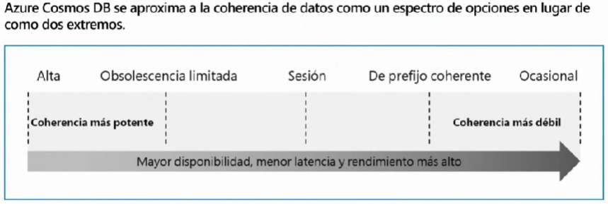

La coherencia entonces hace referencia a **la sincronización de información entre los distintos accesos**

La **Coherencia** dentro de CosmosDB se miden en 5 niveles de **mayor a menor coherencia**:

- **Alta o Fuerte** (Strong): Cuando una operación de escritura se realiza en la base de datos principal, se replica en los instancias de réplica. La operación de escritura no se confirma (y está visible) en la base de datos principal hasta que todas las réplicas han confirmado

- **Obsolescencia limitada** (Bounded stanless): Este nivel es similar al anterior. Su principal diferencia es que se puede configurar cómo pueden estar los documentos obsoletos dentro de las réplicas. El término obsolescencia significa la cantidad de tiempo (o el número de versiones) que un documento de una réplica puede estar detrás del documento principal

- **Sesión** (Session): Este nivel garantiza que una sesión de usuario todas las operaciones de lectura y escritura son coherentes. En la sesión de usuario, todas las operaciones de lectura y escritura son monotónicas y está garantizado que son coherentes en las instancias principal y de la réplica

- **Prefijo coherente** (Consistent prefix): Este nivel tiene una coherencia flexible, pero garantiza que cuando las actualizaciones se muestren en las réplicas, lo harán en el orden correcto (es decir, como prefijos de otras actualizaciones) y sin espacios

- **Ocasional** (Eventual): Este nivel tiene la coherencia más flexible y esencialmente confirma de inmediato todas las operaciones de escritura que se realicen en la base de datos principal. Las transacciones de réplica se controlan de forma asincrónica y, eventualmente (con el tiempo), serán coherentes con la base de datos principal. Este nivel es el que tiene el mejor rendimiento, ya que la base de datos principal no necesita esperar hasta que se confirmen las réplicas para finalizar sus transacciones

> NOTA: Cuánto **menor coherencia**, mayor la **disponibilidad**, menor la **latencia** y **rendimiento** más alto

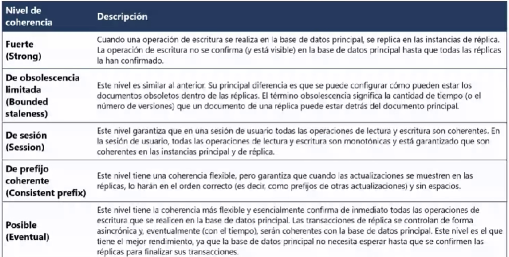

>> [Vuelve al Índice o descansa un rato la vista](#índice)😎

---
---
---

# Módulo 5: 
# (Implementación de soluciones de infraestructura como servicio)
>>`<Clase del x/07/2022>`


>> [Vuelve al Índice o sal con los amigos un rato](#índice)😎

---
---
---

# Módulo 6: 
# (Implementación de la autenticación y autorización de usuarios)
>>`<Clase del x/07/2022>`


>> [Vuelve al Índice o haz una maratón de una serie](#índice)😎


---
---
---

# Módulo 7: 
# (Implementación de soluciones en la nube seguras)
>>`<Clase del x/07/2022>`


>> [Vuelve al Índice o date un chapuzón si tienes piscina](#índice)😎

---
---
---

# Módulo 8: 
# (Implementación de API Management)
>>`<Clase del x/07/2022>`


>> [Vuelve al Índice o échate una siesta](#índice)😎

---
---
---

# Módulo 9: 
# (Desarrollo de soluciones basadas en eventos)
>>`<Clase del x/07/2022>`


>> [Vuelve al Índice o date una vuelta en moto](#índice)😎

---
---
---

# Módulo 10: 
# (Desarrollo de soluciones basadas en mensajes)
>>`<Clase del x/07/2022>`


>> [Vuelve al Índice o dale caña a la play](#índice)😎


---
---
---

# Módulo 11: 
# (Instrumentación de soluciones para admitir la supervisión y el registro)
>>`<Clase del x/07/2022>`


>> [Vuelve al Índice o vete a la playa a echar la tarde](#índice)😎


---
---
---

# Módulo 12: 
# (Integración de almacenamiento en caché y entrega de contenido en las soluciones)
>>`<Clase del x/07/2022>`


>> [Vuelve al Índice o date un respiro por haber llegado al final](#índice)😎

>> [ENHORABUENA](https://www.usameme.com/wp-content/uploads/2022/02/congratulations-meme-usameme.jpg) 👏 👏 👏


---
---
---
---
---
---


# Notas personales:
```
Módulo2:
- Añadir ejemplos de decoración de Azure Functions

- Es necesario una decoración para que sea una Azure Function

- Añadir ?name=nombre a la url de la function, añade el nombre a la queue

- Diferencia visual entre binding y triggered en el código

- Desarrollar el apartado "examinando código"

```