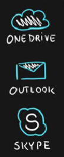
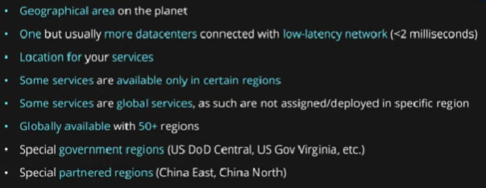

# Azure Fundamentals AZ-900
---
---
>[Link to the exam](https://docs.microsoft.com/en-us/learn/certifications/exams/az-900)

>[Learning Path by Microsoft](https://docs.microsoft.com/en-us/learn/paths/az-900-describe-cloud-concepts/?ns-enrollment-type=exam&ns-enrollment-id=exam.az-900)
-----
-----
# Cloud Computing and Vocabulary
## Cloud Computing

It's a delivery model for services like:
- **Storage**: like files and/or databases
- **Compute Power**: meaning servers such as windows, linux, hosting environments, etc.
- **Networking**: in azure but also outside when connecting to your company network
- **Analytics**: services for visualization and telemetry data

There are more services, but those are the four main (all of this delivered by the **internet**)

The Cloud Computing also has some characteristics which make them so useful:
- Scalability
- Elasticity
- Agility
- Fault Tolerance
- High Availability

Other benefits are:
- Geo-distribution
- Consumption-based model
-----
## Scalability

Scalability is the ability to scale

Scaling is a process of:
- **Allocating** (adding) resources
- **Deallocating** (removing) resources

Apps in the cloud can scale vertically and horizontally:
- **Scale vertically** to increase compute capacity by adding RAM or CPUs to a virtual machine
- **Scaling horizontally** increases compute capacity by adding instances of resources, such as adding VMs to the configuration

-----
## Elasticity

Elasticity is the ability to scale dynamically

(If that scale is automatically, we're talking about automatic scaling which is elasticity)

-----
## Agility

Agility is the ability to react quickly, specifically abut allocating and deallocating resources

> **On-premise** means hardware in the area of the company (may refers to opposite of cloud, but also private cloud)

----
## Fault Tolerance

Fault tolerance is the ability to remain up and running during component and service failures

Disaster is a serious disruption of services caused by natural or human-induced causes (they can affect entires Azure's regions) and **Disaster Recovery** is the ability to recover from that event

By taking advantage of cloud-based backup services, data replication, and geo-distribution, you can deploy your apps with the confidence that comes from knowing that your data is safe in the event of disaster

-----

## High Availability

Availability is a measure of system uptime for users/services which is measured by porcentage

The way we measure it: **availability = uptime/(uptime + downtime)**

**High availability** is the ability to keep services running for extended periods of time with very little downtime (the downtime refers to the maintenance which needs to turn off the services while the course)

Depending on the service-level agreement (SLA) that you choose, your cloud-based apps can provide a continuous user experience with no apparent downtime, even when things go wrong

- Each company decide how many 9's the availability need to have in order to consider the service **High**

- They also decide to express the availability in terms of year, month or day

- Depending of the criticaly of your system, you need to choose whenever this system should be highly available or not (in Azure, many services has high availability by default)

## Geo-distribution

You can deploy apps and data to regional datacenters around the globe, thereby ensuring that your customers always have the best performance in their region

## Consumption-based model

Cloud service providers operate on a consumption-based model, which means that **end users only pay for the resources that they use**

- No upfront costs.
- No need to purchase and manage costly infrastructure that users might not use to its fullest.
- The ability to pay for additional resources when they are needed.
- The ability to stop paying for resources that are no longer needed.

-----
-----
-----
# Principle of economies of Scale
## Economies of Scale

The principle of economies of scale states that as the companies grow they become **more effective** at managing shared operations. Be that HR and hiring, taxes, accounting, internal operations, marketing, big purchases via contracts meaning better discounts, etc

Because of those, companies can save/earn more which in return allows for **reduction in cost** of their services to their customers. This is so called **price per unit**

It’s not possible to go to 0 because in the end some underlying infrastructure needs to run to provide the services. But the larger the scale the **more benefits can be passed to customers**

In fact, in the current scale, Microsoft can already offer multiple services for free due to how small a fraction of the cost it is for them

---
---
---
# CapEx vs OpEx and their differences
## Capital Expenditure (CapEx)

- Basically means, buying your **own infrastructure** and maintain it

- It requires a **big initial investment**

## Operational Expenditure (OpEx)

- It is about **renting infrastructure**

- There is no **initial investment** since you pay for **what you use**, scaling the services when need it

- The **maintenance** is up to you, which means it depends on what kind of renting are you in (but in general, the rent of the infrastructures came with services to maintain themself and working staff who manage it without you to hire no one)

## Differences

To sum up, **CapEx** is related to **On-premise** infrastructures, while **OpEx** is related to the **Cloud**

---
---
---
# Consumption-based Model

The consumption-based model is a **pricing model** used in the cloud so that customers are only charged **based on their resource usage**

This model is characterized by:
- No associated upfront cost

- No wasted resources as such no charges are incurred for unused resources. Unused in this case is different per service. For instance, blob storage that stores any data is considered to be used, as it consumes the storage space. Virtual Machines that are running consume CPU, memory and other resources even if there isn’t any traffic. Hence they are considered to be used and will incur charges

- Pay for what you need

- Stop paying when you don’t

**Consumption is the virtual metric** used to calculate how much each resource (service) in Azure was used. Each service has many smaller metrics that track its consumption to offer best possible pricing model. Those metrics are tracked on very granular level

---
---
---
# Cloud Service Models responsibilities

**As a service** means which party will manage the particular layer and all the layers below

- **Software layer** consists the application (application code and set) & the application data

- **Platform layer** means all the supporting software and the operating system required to host the application

- **Infrastructure layer** consists hardware the infrastructure and virtualization required to host the platform

> If the customer owns the physical severs, that means they have their own data centers/server rooms. This is so-called **On-Premise Enviroment**

## Infrastructure as a Service (IaaS)

Use common cases:
- **Migration of workloads**
- **Test and development**
- **Storage, backups and recovery**

## Platform as a Service (PaaS)

Use common cases:
- **Development framework**
- **Analytics and business intelligence**

## Software as a Service (SaaS)

Use common cases:
- **Buying of-the-shell (license) applications**

## Comparation

**Responsibility Matrix:**

---
---
---
# Public, Private and Hybrid Cloud

**Cloud Deployment Model** is simple a separation which describes where are the company resources deployed. Whenever this is in public cloud provider environment or private datacenter

There are so many reason why this three models exists, in which are include politics, security, cost and options about recovery

## Public Cloud

## Private Cloud

## Hybrid Cloud

---
---
---
# Geographies, Regions and Availability Zones

## Data Center

## Region

We choose the region closest as possible to our client for their services location (the closer it is, the lower the delay it is between the data center and the client)

## Availability Zones

- **Not all regions** are supported

- Supported regions has **three or more zones**

## Zones Services

## Region Pairs

## Geographies

---
---
---