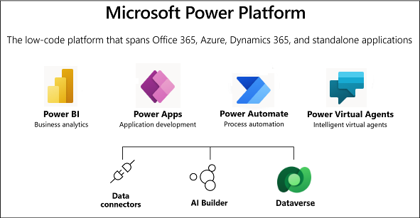
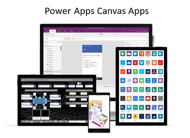
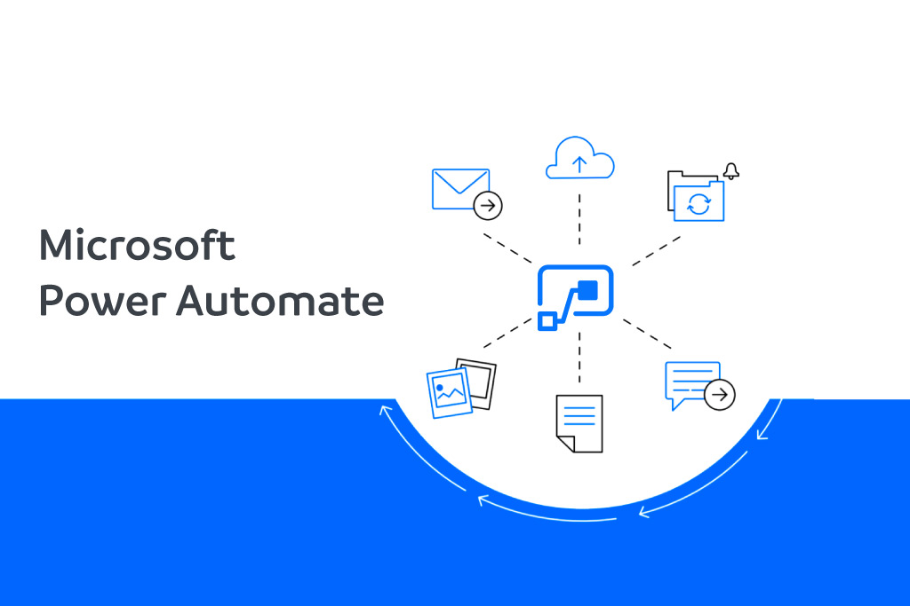
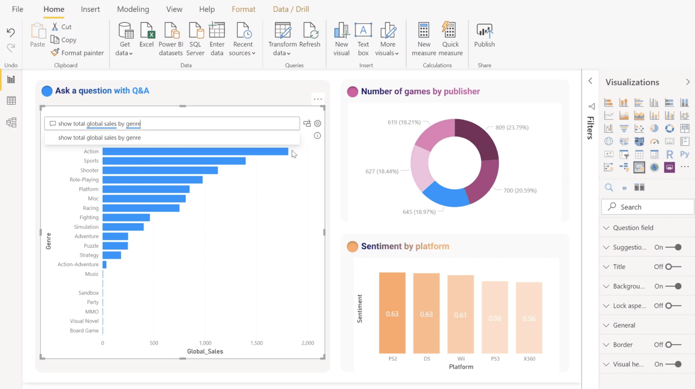
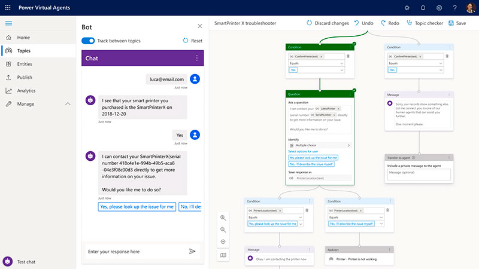

# Power Platform Fundamentals PL-900
---
---
>[Link to the exam](https://docs.microsoft.com/es-es/learn/certifications/exams/pl-900)

>[Learning Path by Microsoft](https://docs.microsoft.com/es-es/learn/paths/power-plat-fundamentals/)
-----
-----

# What is Microsoft Power Platform

**Power Platform** is a platform with a set of tools integrated which allow users and organizations to create in a easy way and fast applications, analyze data or automatizate processes to increase the productivity

This tools are:
- **Power Apps**
- **Power Automate**
- **Power BI**
- **Power Virtual Agents**

The components used:
- **AI Builder**
- **Common Data Service**
- **Data Connectors**

---
---
---
# Tools of Power Platform
## Power Apps

It is a **low-code** developer environment for **building costumed apps** for **business needs**

The environment is very simple so **every level of user** can develop applications with it 

It's also prepared for creating **multiplatform apps** in the **resolution** needed

## Power Automate

Allow users create **automated workdlows** between applications and services

It helps automate **repetitive business processes** such as communitaction, data collections and decision approvals

## Power BI

It is a **business analytics service** that delivers insight for analyzing data

It can share those insight through data visualizations which **make up reports** and **dashboards** to enable **fast informed decisions**

Also **scales across an organization** and it has a built-in governance and security, allowing businesses to **focus on using data more than managing it**

It **displays data in ways that can make more sense** to the users

## Power Virtual Agents

Enables everyone to create **powerful chat bots** using a **guided no-code graphical interface**

Users can **enable chatbots** to perform an action by simply calling a power automate **flow**

**Flows** help automate activities or call **back-end systems**

User can utiliza existing flows that **have been created** in their poweapps environment or they can **create a flow** within Power Virtual Agents authoring canvas

---
---
---
# Common Data Service (DATAVERSE)

It is a **scalable data service** and **app platform** which lets users securely store and manage date from **multiple sources** and **integrate that data** in business applications using a common data model

It is the **common currency** that **enables the power components** to work together, display and manipulate data

---
---
---
# Connectors

It is a **proxy** or **wrapper** around an **API** that allows the underlying service to talk to Microsoft Power Automate, Apps and Azure Logic Apps

It provides a way for users to connect their accounts and leverage a set of **prebuilt actions** and **triggers** to build their apps and workflows

To sum up, they are the **bridges from your data source to your app, workflow or dashboard**

The data sources for connectors are two:
- **Tabular data**
- **Function-based data**

Both of this data source types are commonly used to **bring data and additional functionality** to your solutions

> The Power Platform has **more than 275 connectors** available to common data sources

## Tabular Data

It's one that returns data in a **structures table format** and powerapps can **directly read** and **display** this tables

Additionally, if the **data source support it**, powerapps can create, edit and delete data from the data sources

Examples:
- **Common data service**
- **Sharepoint**
- **SQL Server**

## Function-based Data

It's one that **uses functions to interact** with the data source

These functions can use to return a **table of data** but offer **more extensive actions** such as ability to send an email, update permissions or create a calendar event

Examples:
- **Office 365 users**
- **Projects online**
- **Azure Blob Storage**

## Kinds of Connectors

Connectors are divided into **standard and premium**

Some popular **standard connectors** are:
- **Sharepoint**
- **Outlook**
- **Youtube**

**Premium connectors** requires additional licensing for your app or users:
- **SQL Server**
- **Survey Monkey**
- **Mailchimp**

> There is an option to **build a custom connector**, this allow to extend the app by calling a publicy available api or a costum api we are hosting in a cloud provider

---
---
---

## Operation with Connectors
# Triggers

---
---
---